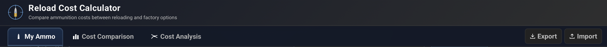

# Reload Estimator — User Guide

Reload Estimator is an application that helps you compare the true cost of reloading your own ammunition against buying factory-loaded rounds. It accounts for component prices, taxes, fixed fees, and one-time equipment purchases to give you a clear picture of your real savings or costs.

---

## Table of Contents

1. [Overview](#1-overview)
2. [My Ammo](#2-my-ammo)
   - [Adding a Reload Entry](#21-adding-a-reload-entry)
   - [Adding a Factory Ammo Entry](#22-adding-a-factory-ammo-entry)
   - [Managing Entries](#23-managing-entries)
   - [Default Taxes & Fees](#24-default-taxes--fees)
3. [Cost Comparison](#3-cost-comparison)
4. [Cost Analysis (Break-Even)](#4-cost-analysis-break-even)
   - [Load Selection](#41-load-selection)
   - [Equipment Costs](#42-equipment-costs)
   - [Reading the Chart & Stats](#43-reading-the-chart--stats)
5. [Import & Export](#5-import--export)
6. [Tips & Notes](#6-tips--notes)

---

## 1. Overview

The application has three main tabs accessible from the navigation bar at the top:

| Tab | Purpose |
|-----|---------|
| **My Ammo** | Library of all your ammo entries — reloads and factory |
| **Cost Comparison** | Side-by-side cost breakdown for selected reload and factory entries |
| **Cost Analysis** | Break-even chart showing when reloading pays off after equipment investment |

A fourth **Editor** tab appears automatically whenever you are adding or editing an entry.

---

## 2. My Ammo

The **My Ammo** tab is where you build and maintain your ammunition library. Entries are grouped by type — reloads first, then factory ammo — and sorted cheapest to most expensive within each group.

### 2.1 Adding a Reload Entry

Click **Add Ammo** in the top-right corner of the My Ammo tab. The Editor tab will open. Set the **Load Type** to **Reload** and fill in the following sections:

**Ammo Information**
- **Caliber** — the cartridge designation (e.g. *9mm Luger*, *.308 Win*).

**Powder**
- Powder name, measurement system (Imperial grains or Metric grams), price per lb/kg, and charge weight per round.

**Primers**
- Primer name, price, and the quantity that price covers (default 100).

**Bullets / Projectiles**
- Bullet description, price, and quantity (default 100).

**Brass / Cases**
- Brass description, price, quantity, and how many times each case will be reloaded before replacement. The cost per round is divided by this reuse count.

**Sales Tax**
- The sales tax percentage applied to your total component cost.

A **Live Preview** panel on the right updates in real time as you type, showing the per-round cost breakdown and totals for 50, 100, and 1000 rounds.

Click **Save Load** or **Update Load** when done. The entry appears immediately in My Ammo and becomes available in Cost Comparison and Cost Analysis.

### 2.2 Adding a Factory Ammo Entry

Set the **Load Type** to **Factory Ammo**. The form changes to:

**Base Factory Price**
- Price per box and rounds per box.

**Factory Taxes**
- Sales tax (%), State excise tax (%).

**Additional Fixed Cost**
- A flat fee spread over a number of rounds — useful for background check fees (e.g. $25 over 500 rounds = $0.05/rd extra) if applicable in your State.

### 2.3 Managing Ammo Entries

Each ammo card has three action buttons in its top-right corner:

| Button | Action |
|--------|--------|
| ✏️ Edit | Opens the entry in the Editor tab |
| ⧉ Duplicate | Creates a copy of the entry (useful for variants of the same load) |
| 🗑 Delete | Permanently removes the entry |

Click the **▸ / ▾** chevron on the left of the action buttons to expand a card and see the full component cost breakdown.

Use the **Search** box to filter cards by name, caliber, type, or component name.

### 2.4 Default Taxes & Fees

At the top of My Ammo there is a **Default Taxes** panel. Values set here are used to pre-populate the tax fields whenever you create a new entry, saving repetitive data entry.

- **Reload** — sales tax percentage applied to reload component costs.
- **Factory** — sales tax %, excise tax %, fixed fee amount, and the number of rounds that fee covers.

Click **Apply to All** to update every existing entry in your library with the current defaults at once.

You can also reset taxes to defaults on a per-entry basis using the **Reset to defaults** link inside the Editor.

---

## 3. Cost Comparison

The **Cost Comparison** tab lets you select any combination of reload and factory entries and compare their costs side by side.

**Selecting entries**  
Click any entry in the selection list to toggle it on or off. Selected entries are highlighted — green for reloads, amber for factory ammo. You can select multiple reloads and multiple factory entries simultaneously.

**Reading the comparison**  
Once entries are selected, the view shows:

- A **bar chart** of cost per round for every selected entry.
- A **cost table** with totals for 50, 100, and 1,000 rounds for each entry.
- A **Difference** section (visible when at least one reload and one factory entry are selected) showing how much cheaper your reload is per round, per 50, per 100, and per 1,000 rounds.

Use the **Search** box above the selection list to filter by name, caliber, type, or component.

---

## 4. Cost Analysis (Break-Even)

The **Cost Analysis** tab shows how the cumulative cost of reloading (including your one-time equipment investment) compares to buying factory ammo over time, and at what point reloading becomes cheaper overall.

### 4.1 Load Selection

The left column lists all your reload and factory entries with checkboxes. Check the entries you want to include in the averages. If nothing is checked, **all entries of each type are included automatically**.

### 4.2 Equipment Costs

The right column is where you enter your one-time reloading equipment costs — press, dies, tumbler, scale, etc.

- Type a name and price in the **New item** row and press **Enter** or click **+** to add it.
- Click **✕** to remove an item.
- The running **Total Equipment Cost** is shown at the bottom.

This total is treated as an upfront investment that your per-round savings must recover before reloading becomes net-positive.

### 4.3 Reading the Chart & Stats

The **stats bar** across the middle column shows four key figures at a glance:

| Stat | Meaning |
|------|---------|
| **Avg Reload Cost** | Average cost per round across selected reload entries |
| **Avg Factory Cost** | Average cost per round across selected factory entries |
| **Savings per Round** | Factory average minus reload average |
| **Break-Even Point** | Number of rounds until cumulative savings cover total equipment cost |

The **chart** below plots two lines:
- **Reload line** — cumulative spend including the equipment investment upfront, declining in slope as per-round costs are cheaper than factory.
- **Factory line** — cumulative spend at factory prices with no upfront cost.

The point where the lines cross is the **break-even point**, marked on the chart. After that point, every round you reload puts money back in your pocket.

If the reload average is higher than the factory average (reloading is more expensive per round), the lines never cross and a warning is shown.

---

## 5. Import & Export

Your entire library — ammo entries, tax defaults, equipment costs, and load selections — can be saved to a single JSON file and restored later or shared with another computer.

**Exporting**  
Click **Export** in the top navigation bar. A `.json` file will be downloaded to your machine.

**Importing**  
Click **Import** and select a previously exported `.json` file. All data in the file will replace the current library.

> WARNING: Import overwrites your current data. Export first if you want to keep your existing entries.

---

## 6. Tips & Notes

- **All data is stored locally.** No account or internet connection is required. Data is saved automatically in the browser/app storage every time you make a change.
- **Brass reuse count matters.** Setting a realistic reuse count (commonly 5–10 reloads per case) significantly lowers your per-round brass cost. A count of 1 treats every case as single-use.
- **State Excise Tax (SET).** Factory ammunition in some US States is subject to a state excise tax in addition to state and local sales tax. The default value is pre-filled for you.
- **Fix Fee (FF).** Some US States have an additional fix fee (normally associated to a background check) on any ammunition purchases. This is a fixed fee and applied to the entire purchase and its cost is diluded over all the rounds purchased.
- **Accuracy of results.** All costs are estimates based on the prices you enter. Check current component and ammo prices regularly — they fluctuate.
- **Duplicating entries** is a quick way to model variants: duplicate a load, change the powder charge or bullet weight, and compare side by side in the Cost Comparison tab.
- **Equipment costs** only need to be entered once. They persist between sessions and are included in export files.
