# Reloading Tracker 2.0.0: User Guide

Reloading Tracker is an application for managing your reloading activity. At its core it is a production log: define your loads, record each pressing session with a unique lot number, and print a label for every box on your shelf. If you also want to understand the economics of reloading, the application goes further, comparing the cost of your reloads against factory ammunition, tracking your progress toward break-even, and accounting for component prices, taxes, fixed fees, and one-time equipment purchases.

[Try it out](https://fmalpartida.github.io/reloading-cost-calculator)

## ⚠️ IMPORTANT SAFETY DISCLAIMER ⚠️

> **WARNING: DO NOT USE THE LOAD DATA IN THIS GUIDE.**
>
> Any load recipe shown in this guide (powder charges, bullet weights, COALs, or any other reloading data) is for **illustration purposes only**. These values are **not safe for use** in actual reloading.
>
> **Always build your loads from reliable, published reloading data** from reputable sources such as powder manufacturers, bullet manufacturers, or established reloading manuals. Never copy load data from screenshots, examples, or guides like this one.
>
> Improper reloading can result in serious injury, death, or property damage.

---

## Table of Contents

1. [Overview](#1-overview)
   - [Recommended Workflow](#recommended-workflow)
   - [Tabs at a Glance](#tabs-at-a-glance)
2. [My Ammo](#2-my-ammo)
   - [Adding a Reload Entry](#21-adding-a-reload-entry)
   - [Adding a Factory Ammo Entry](#22-adding-a-factory-ammo-entry)
   - [Managing Entries](#23-managing-entries)
   - [Load Status](#load-status)
   - [Default Taxes & Fees](#24-default-taxes--fees)
3. [My Components](#3-my-components)
   - [Adding a Component](#31-adding-a-component)
   - [Managing Components](#32-managing-components)
   - [Linking Inventory to Loads](#33-linking-inventory-to-loads)
4. [Reloading Journal](#4-reloading-journal)
   - [Logging a Session](#41-logging-a-session)
   - [Managing Journal Entries](#42-managing-journal-entries)
   - [Printing a Lot Label](#43-printing-a-lot-label)
   - [Journal Statistics](#44-journal-statistics)
5. [Range Log](#5-range-log)
   - [Logging a Range Session](#51-logging-a-range-session)
   - [Managing Range Sessions](#52-managing-range-sessions)
   - [Starring Sessions](#53-starring-sessions)
   - [Range Log Statistics](#54-range-log-statistics)
6. [Cost Analysis (Break-Even)](#6-cost-analysis-break-even)
   - [Load Selection](#61-load-selection)
   - [Equipment Costs](#62-equipment-costs)
   - [Reading the Chart & Stats](#63-reading-the-chart--stats)
7. [Cost Comparison](#7-cost-comparison)
8. [Guided Tour](#8-guided-tour)
9. [Settings & About](#9-settings--about)
10. [Import & Export](#10-import--export)
11. [Tips & Notes](#11-tips--notes)

---

## 1. Overview

### Recommended Workflow

Reloading Tracker follows a natural progression that mirrors the way reloading actually works. The first three steps are the core workflow, useful for any reloader regardless of whether you care about costs. Step 4 is for those who also want to track cost and break-even progress.

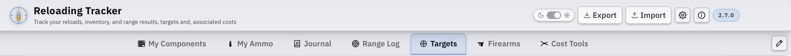

**Step 1: Define your loads**

Before you can log sessions, the application needs to know what you are reloading. You have two ways to add a load:

- **Direct entry in My Ammo.** Open the Editor tab and fill in the load details. This is the fastest way to get started.
- **Build a component library first (recommended).** Go to **My Components** and add your powders, primers, bullets, and brass. Then, when you create a load in My Ammo, select each component from the inventory instead of typing values by hand. Any future price change (a new jug of powder, a bulk primer buy) only needs to be updated in one place, and every load that uses that component recalculates automatically.

> **If you plan to use the cost features**, accuracy starts with the prices you enter. Use the actual prices you paid, including shipping if it meaningfully affects the per-unit cost. Update component prices when you buy a new batch. The closer your entries are to real-world costs, the more the numbers you see will reflect your true reloading economics rather than a rough estimate.

If you use Cost Analysis or Cost Comparison, also add at least one **factory ammo** entry (with its box price, taxes, and any fixed fees) so the comparison and break-even analysis have a meaningful baseline to work against.

**Step 2: Log your pressing sessions in the Journal**

Every time you sit down at the press, open the **Journal** tab and add an entry: select the load, enter the date and the number of rounds you produced. The application assigns a unique, incrementing lot number automatically.

This is where the application starts working for you over time. Each session builds a complete production history: what you made, when you made it, and how much. That record is valuable on its own as a traceable log of every batch you have ever pressed, and it also feeds directly into Cost Analysis if you want to track your progress toward break-even.

**Step 3: Print lot labels**

After logging a pressing session, click the **Print** button on the journal entry. The label dialog opens with the lot number and quantity already filled in from the session. Review the label (load name, caliber, components, COAL) and print. Attach it to the ammo box before it goes on the shelf. Every box in your storage is now traceable back to a specific lot in the journal. You can also print an additional label for your reloading log book.

**Step 4: Take it to the range and log the session**

After a range trip, open the **Range Log** tab and add a session: choose the firearm you used, the date, the distance you shot, and the lots you burned through. You can record multiple lots in a single outing — each with its own round count, charge weight, COAL, and notes — so each lot tells you exactly how it performed at the range.

Over time the Range Log becomes a searchable field record that connects every range session to the specific lots and load recipes that produced it. Star sessions that produced exceptional results so you can find them later; use the starred filter to pull up only your reference loads when you are at the bench deciding what to reload next.

> **The bench-to-range loop.** The Journal and the Range Log together close the loop on every batch of ammo you press. The Journal tells you what you made and when. The Range Log tells you how each lot performed when it counted. Together, they make it straightforward to decide which loads are worth pressing again and which recipes to refine.

**Step 5 (optional): Review your costs and track break-even**

With pressing sessions accumulating in the journal, open **Cost Analysis** and switch to **Rounds** mode. Your journal rounds are automatically added to your reload entries. Watch the break-even chart as your position on the reload line advances toward the intersection with factory costs. The stats panel shows you exactly how many rounds remain until your equipment pays for itself, and how much you have already saved.

Use **Cost Comparison** at any time to see side-by-side which of your loads is the most economical, or to check whether a specific factory ammo purchase would have been cheaper than your reload for that caliber.

---

The more consistently you log your sessions, the more the application rewards you. A year of journal and range-log entries is both a complete production and performance record of every lot you have ever pressed and, if you use the cost features, a genuine financial picture of what reloading saves you.

---

### Tabs at a Glance

The application has six main tabs accessible from the navigation bar at the top:

| Tab | Purpose |
|-----|---------|
| **My Ammo** | Library of all your ammo entries: reloads and factory |
| **My Components** | Global catalog of reloading components: powders, primers, bullets, and brass |
| **Journal** | Log pressing sessions with auto-incrementing lot numbers, dates, quantities, and notes |
| **Range Log** | Record range sessions: firearm, distance, lots fired, round counts, performance notes |
| **Cost Analysis** | Break-even chart showing when reloading pays off after equipment investment |
| **Cost Comparison** | Side-by-side cost breakdown for selected reload and factory entries |

A seventh **Editor** tab appears automatically whenever you are adding or editing an ammo entry.

There are also built-in **Tour**, **About**, and **Settings** controls in the top navigation area. Tour launches a guided walkthrough of the main areas of the application, About shows application/version/author/license information, and Settings lets you adjust display preferences such as theme behavior, currency symbol, and cost precision.

---

## 2. My Ammo

The **My Ammo** tab is where you build and maintain your ammunition library. Entries are grouped by type: reloads first, then factory ammo (sorted cheapest to most expensive within each group). Each group has a colored section header with a **+** button to add a new entry of that type directly.

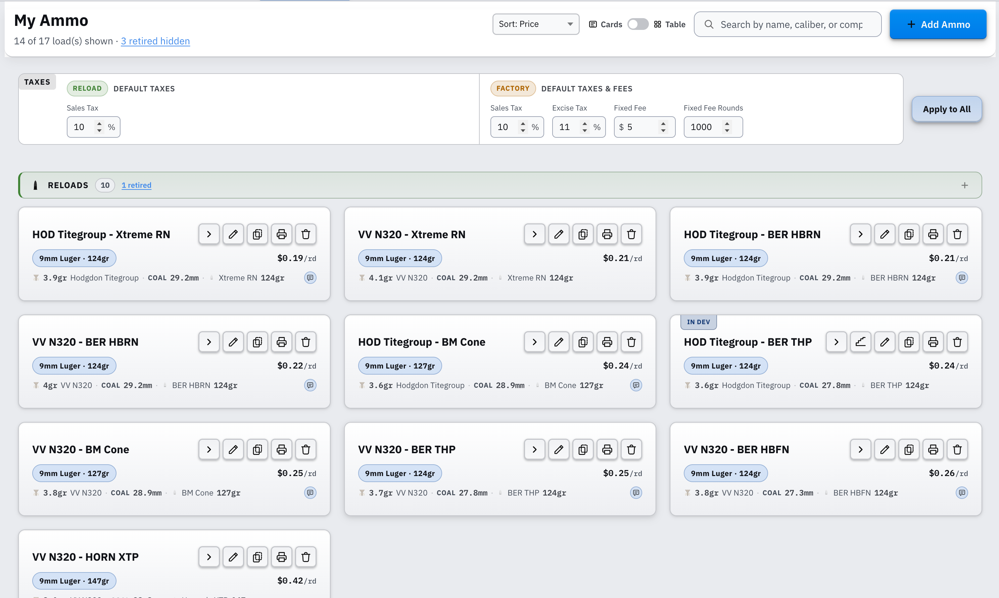

### 2.1 Adding a Reload Entry

Click **Add Ammo** in the top-right corner of the My Ammo tab, or click the **+** button in the **Reloads** section header. The Editor tab will open with **Reload** pre-selected as the load type. Fill in the following sections:

**Ammo Information**
- **Name**: identifies the cartridge. Required.
- **Load Type**: Reload or Factory.
- **Status**: the development state of the load. See [Load Status](#load-status) below.
- **Caliber**: the cartridge designation (e.g. *9mm Luger*, *.308 Win*). This is added when defining the bullet.
- **COAL**: cartridge overall length for this load. Printed on the lot label.
- **Notes**: optional free-text field for dates or any other reference.

**Powder**
- Powder name, measurement system (Imperial grains or Metric grams), price per lb/kg, and charge weight per round.

**Primers**
- Primer name, price, and the quantity that price covers (default 100).

**Bullets / Projectiles**
- Bullet description, weight, diameter, caliber, price, and quantity (default 100).

**Brass / Cases**
- Brass description, price, quantity, and how many times each case will be reloaded before replacement. The cost per round is divided by this reuse count.

**Sales Tax**
- The sales tax percentage applied to your total component cost.

A **Live Preview** panel on the right updates in real time as you type, showing the per-round cost breakdown and totals for 50, 100, and 1000 rounds.

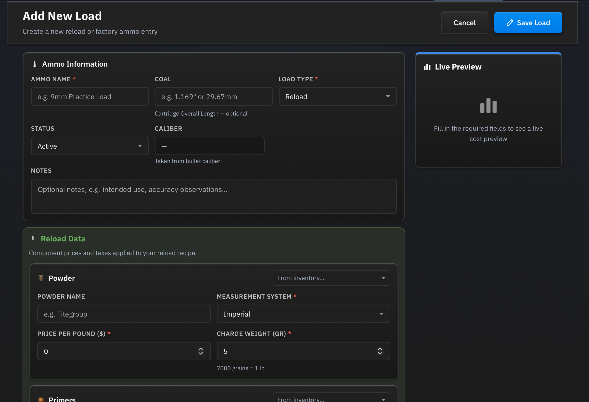

Click **Save Load** or **Update Load** when done. The entry appears immediately in My Ammo and becomes available in Cost Comparison and Cost Analysis.

### 2.2 Adding a Factory Ammo Entry

Click **Add Ammo** or the **+** button in the **Factory** section header. The Editor opens with **Factory Ammo** pre-selected. The form shows:

**Base Factory Price**
- Price per box and rounds per box.

**Factory Taxes**
- Sales tax (%), State excise tax (%).

**Additional Fixed Cost**
- A flat fee spread over a number of rounds, useful for background check fees (e.g. $25 over 500 rounds = $0.05/rd extra) if applicable in your State.

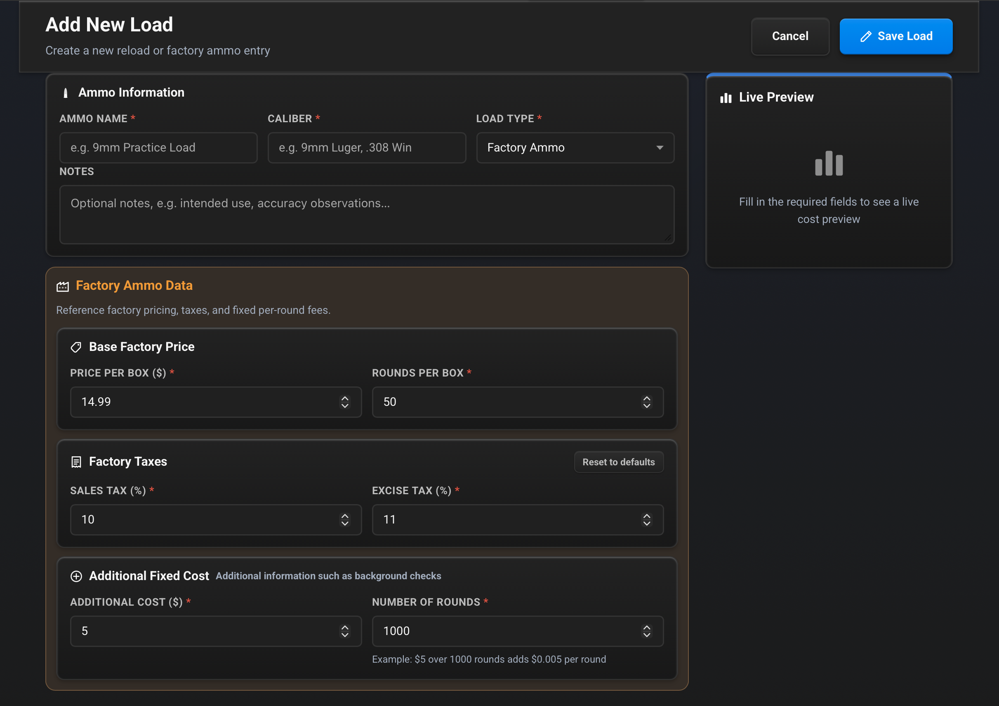

### 2.3 Managing Ammo Entries

Each ammo card has four action buttons in its top-right corner:

| Button | Action |
|--------|--------|
| ✏️ Edit | Opens the entry in the Editor tab |
| ⧉ Duplicate | Creates a copy of the entry (useful for variants of the same load) |
| 🖨 Print | Opens the label print dialog for this load, without a pre-filled lot number or quantity |
| 🗑 Delete | Permanently removes the entry |

Click the **▸ / ▾** chevron on the left of the action buttons to expand a card and see the full component cost breakdown.

Use the **Search** box to filter cards by name, caliber, type, or component name.

You can also switch between **Card** and **Table** views using the view toggle next to the search box. Card view shows the familiar expandable cards, while Table view gives you a denser list that is easier to scan when you have many entries.

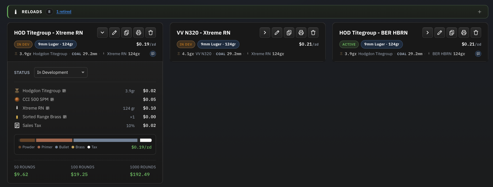

### Load Status

Every ammo entry carries a **status** that describes where it is in your development cycle. The status badge appears on each card and in the table's Status column.

| Status | Meaning |
|--------|---------|
| **Draft** | Entered for cost estimation only; not yet range-verified. Cards show a dashed border as a visual reminder. |
| **In Development** | Actively being worked up at the bench or range. Eligible for Journal logging. |
| **Active** | Proven load, ready to press. Eligible for Journal logging. |
| **Retired** | Recipe superseded or no longer in use. Hidden from default views but preserved in all history and journal entries. |

**Changing the status**
- In card view: expand the card (▸) and use the **Status** selector at the top of the expanded body.
- In table view: use the **Status** dropdown in the Status column.
- In the Editor: the Status field appears in the Ammo Information section next to the load type.

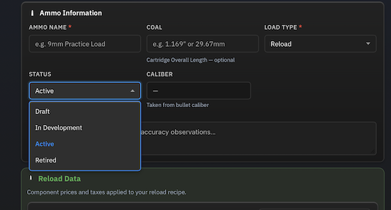 

**Retired loads**
Retired entries are hidden by default to keep your active library clean. When a section (Reloads or Factory) contains retired entries, a **"N retired"** link appears in that section's header bar next to the count. Click it to reveal retired loads; click **"hide retired"** to collapse them again.

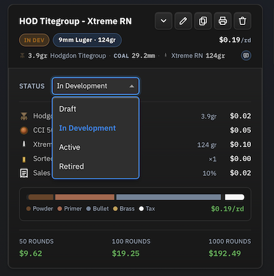

> **Journal and Range Log entries are never affected by status changes.** A retired load's history is fully preserved; only its visibility in the active library changes.

### 2.4 Default Taxes & Fees

At the top of My Ammo there is a **Default Taxes** panel. Values set here are used to pre-populate the tax fields whenever you create a new entry, saving repetitive data entry.

- **Reload**: sales tax percentage applied to reload component costs.
- **Factory**: sales tax %, excise tax %, fixed fee amount, and the number of rounds that fee covers.

Click **Apply to All** to update every existing entry in your library with the current defaults at once.

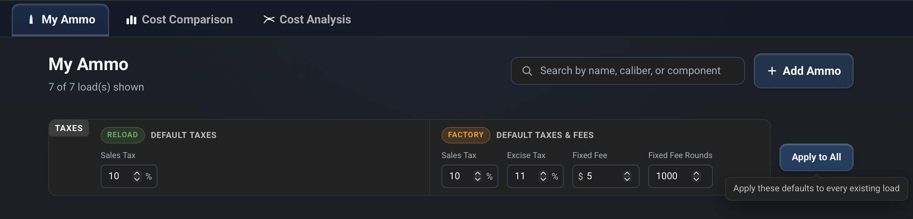

You can also reset taxes to defaults on a per-entry basis using the **Reset to defaults** link inside the Editor.

---

## 3. My Components

The **My Components** tab is a global catalog of reloading components. Instead of typing the same powder name, price, and quantity into every load, you define each component once here and then select it from a dropdown when editing any reload. If a component price changes, update it in the inventory and every linked load updates automatically.

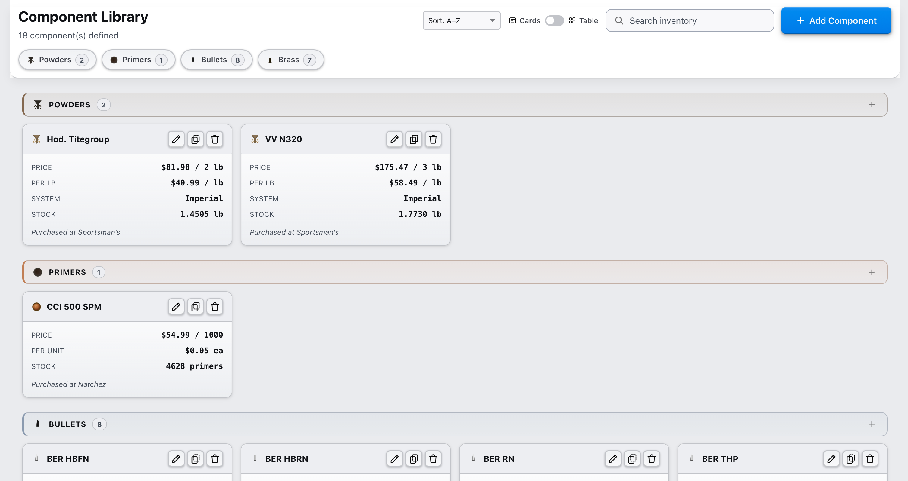

Components are organised into four types: **Powder**, **Primer**, **Bullet**, and **Brass**. They are displayed in grouped sections, each with a colored left-border accent that matches the component's icon.

**Filter tags** at the top of the list let you narrow the view to a single type at a glance; click a tag to activate it, click again to clear the filter.

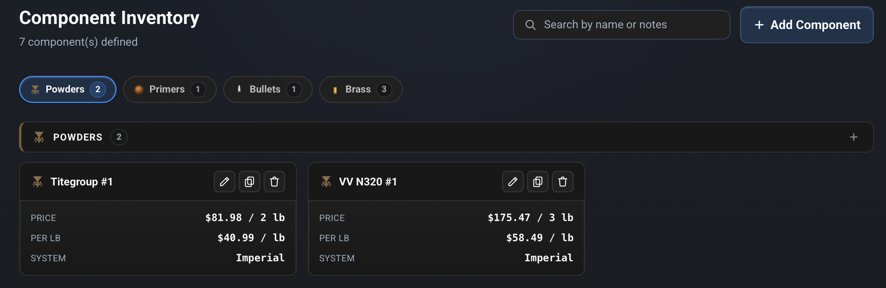

Use the **Search** box to filter components by name or notes across all groups.

Like My Ammo, My Components also supports **Card** and **Table** views through the view toggle near the search box.

### 3.1 Adding a Component

Click **Add Component** in the top-right corner, or click the small **+** button in any group header to pre-select that component type.

**Component Type**  
Choose one of the four types using the selector buttons at the top of the form. Once a component is saved the type cannot be changed; duplicate it and delete the original if you need a different type.

**Name / Description** *(required)*  
A descriptive label, e.g. *Titegroup*, *CCI 500 Small Pistol*, *124gr FMJ RN*, *Mixed once-fired 9mm*.

**Price** *(required)*  
The price you paid for the component. For powders this is the price per pound (Imperial) or per kilogram (Metric). For all other types it is the total price for the quantity below.

**Quantity / Weight** *(required)*  
- *Powder*: the weight the price covers (lbs or kg). A 1 lb jug entered at $28.99/1 lb stores as $28.99/lb; a 4 lb jug entered at $89.99/4 lb also resolves to the correct per-lb rate when used in a load.
- *Primer, Bullet, Brass*: the number of units the price covers (e.g. 100 primers for $15.99).

**Measurement System** *(powder only)*  
Select **Imperial (lb)** or **Metric (kg)**. This carries through to any load that links to this powder.

**Times Reloaded** *(brass only)*  
How many reloads each case is expected to survive before replacement. This amortises the brass cost across that many rounds.

**Notes**  
Optional free-text field for lot numbers, suppliers, or any other reference.

Click **Save** to add the component. The card appears immediately in its group.

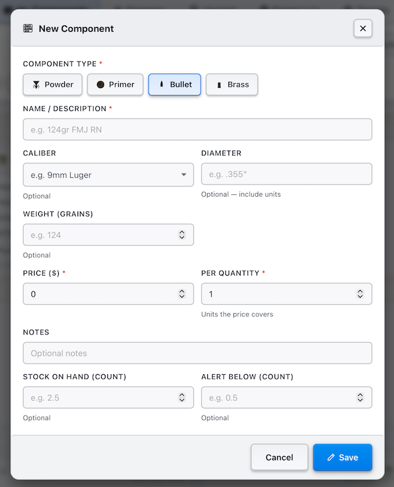

Each component card shows:
- Component name and type icon
- **Price**: the raw price as entered (e.g. *$89.99 / 4 lb*)
- **Per unit**: the derived cost per lb/kg or per single primer/bullet/case (e.g. *$22.50/lb*)
- Brass **Reloads** count (brass cards only)
- Bullet **caliber**, **diameter** and **weight** (bullets only)
- Notes (if any)

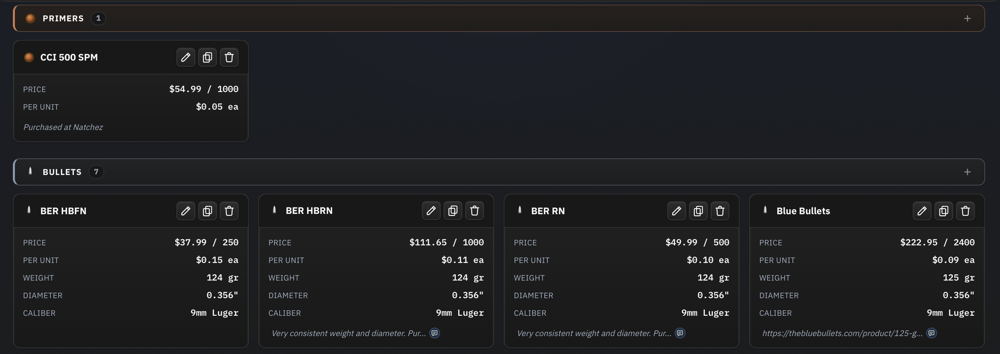

### 3.2 Managing Components

Each component card has three action buttons:

| Button | Action |
|--------|--------|
| ✏️ Edit | Opens the component in the form panel for editing. The type selector is disabled; type cannot be changed after creation. |
| ⧉ Duplicate | Creates a copy with *(copy)* appended to the name, useful when a component comes in multiple package sizes. |
| 🗑 Delete | Permanently removes the component from the catalog. Loads that were linked to it retain their last-known values but lose the live link. |

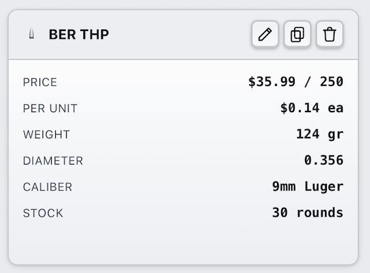

### 3.3 Linking Inventory to Loads

When editing or creating a reload in the **Editor** tab, each component section (Powder, Primers, Bullets, Brass) has a **Select from inventory** dropdown above the manual input fields. Choosing an item from that dropdown fills all the related fields automatically and marks the component with a **linked badge**.

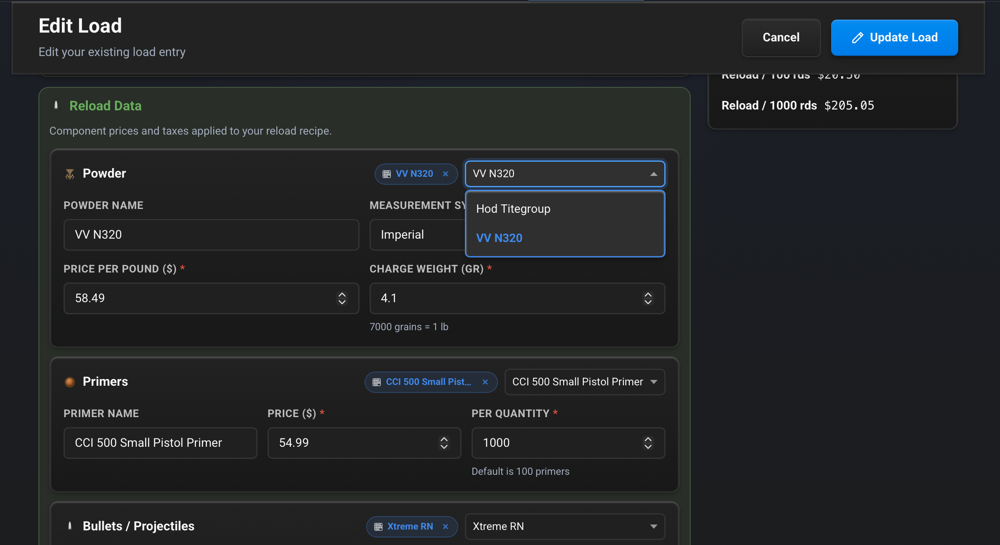

**What the linked badge means:**  
A small inventory icon appears next to the component name to indicate the values are driven by the inventory. If you manually edit any field in that section the link is broken automatically and the badge disappears; the load then stores its own independent copy of those values.

You can also click the **×** on the badge to unlink intentionally without editing any field.

**Auto-update behaviour:**  
When you edit a component in My Components (e.g. update a powder price after buying a new jug), every reload that is still linked to that component has its cost recalculated immediately. No manual re-entry is needed.

> **Tracking cost changes across component batches.** If you want to preserve an accurate cost history when a new batch of a component arrives at a different price, add the new batch as a separate inventory item rather than editing the existing one. Then duplicate the load in My Ammo and link the copy to the new batch. Journal entries logged against the original load retain its original component costs, while the duplicate carries the new batch price going forward. Both loads appear in Cost Analysis, giving you an accurate weighted picture of what you have actually spent across batches.

**Inventory badge in My Ammo:**  
In the expanded card view under My Ammo, any component that originates from the inventory shows a small inventory icon next to its name, so you can tell at a glance which values are managed centrally.

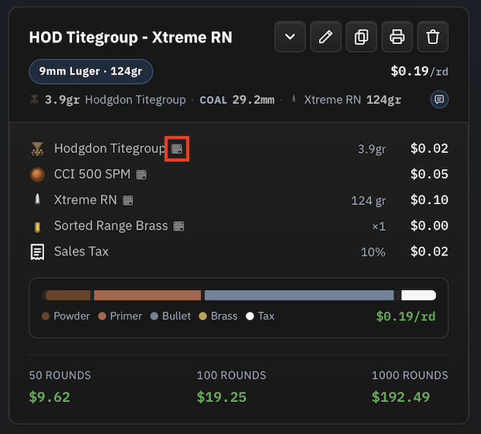

---

## 4. Reloading Journal

The **Journal** tab is the heart of the application for session-based reloaders. Every time you sit down at the press, add an entry with the load you reloaded, the quantity you produced, and the date. Each entry automatically receives a unique, incrementing **lot number** that you can print on an ammo box label. Over time, your journal becomes a complete, searchable production history of every batch you have ever pressed.

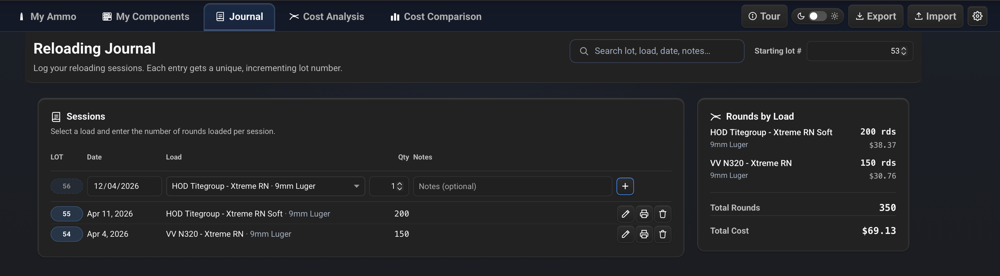

### 4.1 Logging a Session

The **add row** at the bottom of the session list always shows the next available lot number. Fill in:

| Field | Description |
|-------|-------------|
| **Date** | The date of the session (defaults to today) |
| **Load** | Select from your reload entries |
| **Qty** | Number of rounds produced |
| **Notes** | Optional; use for a powder lot, seating depth, or any other reference |

Click **+** or press **Enter** in any field to save the entry. It appears at the top of the list and the lot number advances automatically.

**Starting lot number**  
At the top right of the Journal page you can set the **Starting lot #**. The next lot number is always the first unused number at or above this value. If you raise it above your current highest lot (for example to start a new series at 100), the next entry will begin from that number. If the requested number is already in use, the application finds the next free slot automatically, so duplicate lot numbers can never occur. Use this field to align with a lot series you were already tracking elsewhere or to create a meaningful break in your numbering when switching between projects or calibres.

### 4.2 Managing Journal Entries

Each entry row has three action buttons on the right:

| Button | Action |
|--------|--------|
| ✏️ Edit | Edits all fields inline; the lot number is fixed and cannot be changed |
| 🖨 Print | Opens the label print dialog pre-filled with the lot number and quantity |
| 🗑 Delete | Permanently removes the entry |

Use the **Search** box at the top of the page to filter entries by lot number, date, load name, caliber, or notes.

### 4.3 Printing a Lot Label

Click the **Print** button on any journal entry to open the label print dialog. The **LOT** and **QTY** fields are pre-filled from the entry; just confirm and print.

The label dialog lets you review and adjust every field on the label before committing:

- **Load name and caliber**, taken from the linked reload entry
- **LOT**, pre-filled with the entry's lot number
- **QTY**, pre-filled with the number of rounds logged
- All other label fields (powder, primer, bullet, brass, COAL, notes) are pulled from the load definition

You can also open the print dialog from any ammo card in **My Ammo** using the print button on that card, without a pre-filled lot number.

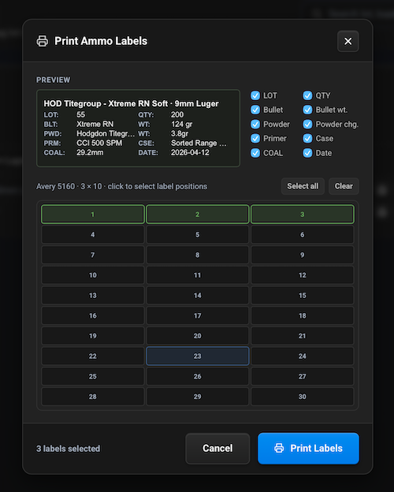

### 4.4 Journal Statistics

The **summary panel** on the right of the Journal tab shows:

- **Rounds by Load**: total rounds produced for each reload, sorted by volume
- **Total cost per load**: rounds multiplied by the cost per round for that load
- **Grand total rounds** and **grand total cost** across all entries

These figures accumulate automatically as you add entries. The cost per round used in the calculation is always the current cost from your load definition.

---

## 5. Range Log

The **Range Log** tab is where you record what happens after the ammo leaves the bench. Every time you go to the range, add a session: choose the firearm, enter the date and the distance, then list each lot you fired along with how many rounds and any per-lot observations. The Range Log supports all three ammo sources: lots from the Reloading Journal, manually entered reload batches, and factory ammunition. Over time it becomes a searchable field record that connects every range trip to the specific lots and load recipes that produced the ammo.

<!-- TODO: Add screenshot of the Range Log tab showing a list of range sessions with expanded lot details -->
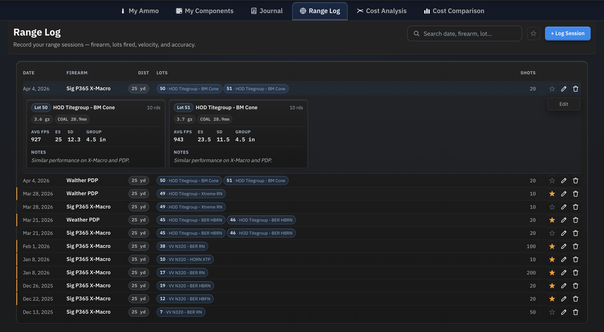

### 5.1 Logging a Range Session

Click **+ Log Session** at the top of the Range Log to open the add form. Fill in:

| Field | Description |
|-------|-------------|
| **Date** | The date of the range trip (defaults to today). Required. |
| **Firearm** | Name of the firearm used (e.g. *Glock 17*, *AR-15 18" SPR*). Type a new name or select a previously used firearm. Required. |
| **Distance** | The distance at which you shot, with a unit selector (yd / m) |
| **Temperature / Wind** | Optional session conditions |
| **Notes** | Optional free-text field for range conditions, impressions, or any other reference |

After filling in the session header, add one or more **lots** to the session using the **Lots fired** section. Each lot row has a mode toggle with three options:

| Mode | When to use |
|------|-------------|
| **From Journal** | The ammo was logged at the press in the Reloading Journal. Select the lot from the dropdown; charge, COAL, and round count pre-fill automatically from the journal entry. |
| **Reload** | A reload batch that was not logged in the Journal. Enter an optional lot number, select the reload recipe, and override charge or COAL if needed. |
| **Factory** | Factory ammunition. Select from your defined factory entries. No charge or COAL fields are shown. |

<!-- TODO: Add screenshot of the Range Log add form showing the From Journal / Reload / Factory mode toggle buttons on a lot row -->
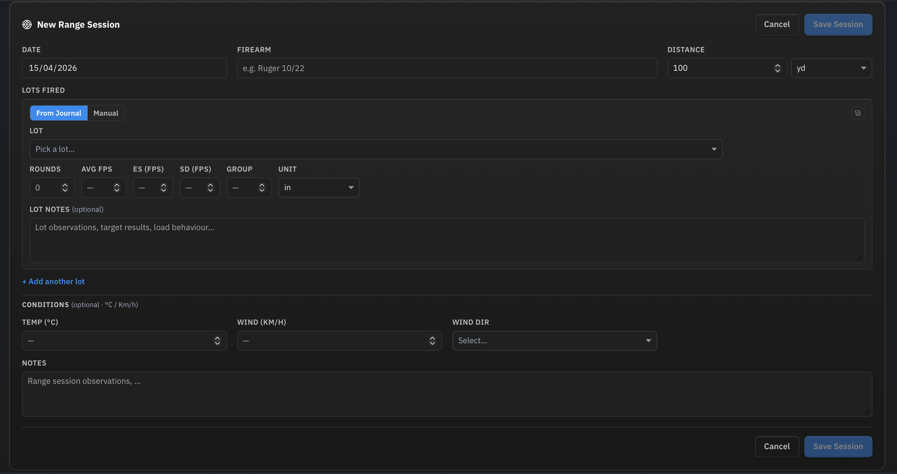

For every lot, regardless of mode, you can also record per-lot performance data:

| Field | Description |
|-------|-------------|
| **Rounds** | Number of rounds fired from that lot |
| **Avg fps** | Average muzzle velocity |
| **ES** | Extreme spread (fps) |
| **SD** | Standard deviation (fps) |
| **Group** | Group size with unit (in / cm / MOA / MIL) |
| **Shots** | Number of shots in the group |
| **Notes** | Per-lot observations |

Use the **⧉** duplicate button on any lot row to quickly copy it when firing multiple similar lots in the same outing. At least one lot must have an ammo selection before the session can be saved.

Click **Save Session** when done. You can add as many lots as you fired during the outing.

### 5.2 Managing Range Sessions

Sessions are displayed as rows in a list, most recent first. Click any row to **expand** it and see the full per-lot breakdown for that session.

<!-- TODO: Add screenshot of an expanded session row showing lot detail rows beneath it -->
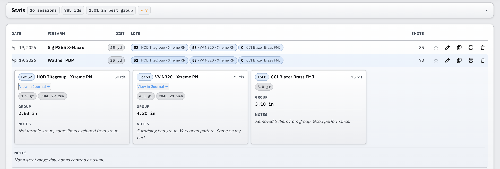

Each session row has action buttons on the right:

| Button | Action |
|--------|--------|
| ★ Star | Marks the session as a reference (see [Starring Sessions](#53-starring-sessions)) |
| ✏️ Edit | Opens the session for editing — you can change the header fields or add and remove lot entries |
| 🗑 Delete | Permanently removes the session and all its lot entries |

Use the **Search** box at the top of the page to filter sessions by firearm, distance, lot number, load name, or notes text.

### 5.3 Starring Sessions

Click the **star button** (☆ / ★) on any session row to mark it as a reference session. Starred sessions display a coloured left-border accent so they stand out in the list.

Click the **starred filter button** (☆) in the page header to toggle the list to show only starred sessions. This is useful when you are at the bench deciding which loads to press again and want to pull up only the sessions that produced your best results.

<!-- TODO: Add screenshot showing starred sessions in the list with the star filter active in the header -->
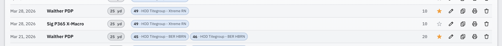

### 5.4 Range Log Statistics

The **statistics panel** at the top of the Range Log gives you an at-a-glance performance summary across all your recorded sessions. Click the bar to expand it.

<!-- TODO: Add screenshot of the Range Log statistics panel expanded, showing KPI tiles and Rounds by Load cards -->
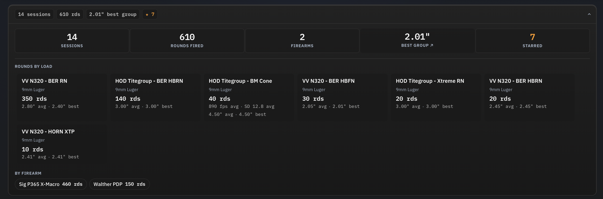

The panel has two sections:

**Key Performance Indicators** — a row of summary tiles across the top:

| Tile | Meaning |
|------|---------|
| **Total Sessions** | Number of range sessions logged |
| **Total Rounds** | Total rounds fired across all sessions |
| **Firearms** | Number of distinct firearms used |
| **Avg FPS** | Average muzzle velocity across all lots with velocity data |
| **Best Group** | Smallest group size recorded, normalised to inches |
| **Avg Group** | Average group size across all lots with group data, normalised to inches |

**Rounds by Load** — a scrollable row of cards, one per distinct load or factory entry. Each card shows:

- Load name and total rounds fired
- Average fps and average SD (if velocity data was recorded for that load)
- Average group size and best group size (if group data was recorded for that load)

The cards let you compare performance across different loads at a glance — useful during load development to see which recipes are consistently grouping best or producing the most consistent velocity.

---

## 6. Cost Analysis (Break-Even)

The **Cost Analysis** tab shows how the cumulative cost of reloading (including your one-time equipment investment) compares to buying factory ammo over time, and at what point reloading becomes cheaper overall.

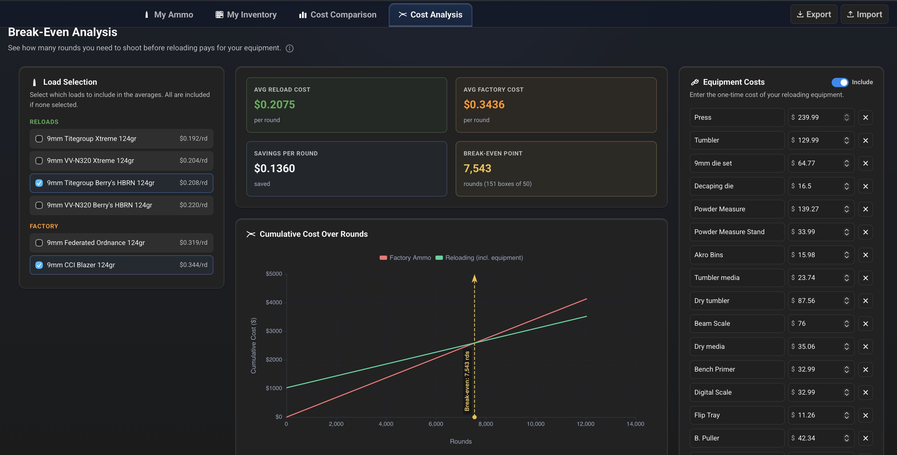

### 6.1 Load Selection

The left column lists all your reload and factory entries.

By default, both reloads and factory ammo use **checkbox selection**. Check the entries you want to include in the averages. If nothing is checked, **all entries of that type are included automatically**.

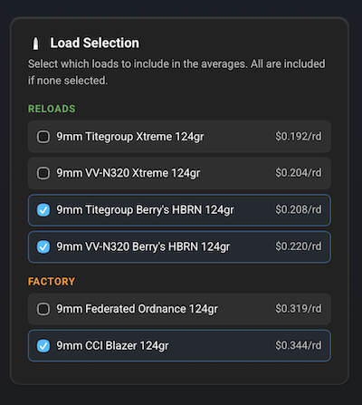

For reloads only, you can also switch to **Rounds** mode using the flip switch at the top of the panel. In this mode:

- Reload entries accept a round count instead of a checkbox.
- The app calculates a **weighted average reload cost** based on the number of rounds entered for each reload.
- Factory ammo remains checkbox-based even in this mode.

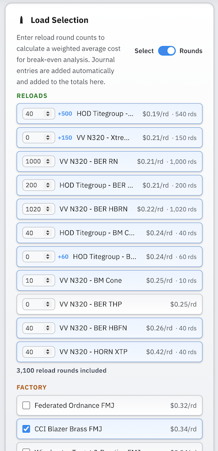

**Journal integration in Rounds mode**

The round counts you log in the **Journal** tab are automatically reflected here. The number shown next to each reload's input is its *effective total*: the value you manually entered (your pre-journal baseline) plus the rounds logged in the journal.

This is designed for reloaders who were already pressing ammo before starting the journal. Enter your historical round count in the input as a baseline; the journal adds to it going forward. If you start fresh, leave the input at zero and the journal fills it in automatically.

### 6.2 Equipment Costs

The right column is where you enter your one-time reloading equipment costs (press, dies, tumbler, scale, etc.)

- Type a name and price in the **New item** row and press **Enter** or click **+** to add it.
- Click **✕** to remove an item.
- The running **Total Equipment Cost** is shown at the bottom.

This total is treated as an upfront investment that your per-round savings must recover before reloading becomes net-positive.

This cost can be ignored by switching off the **Include** switch.

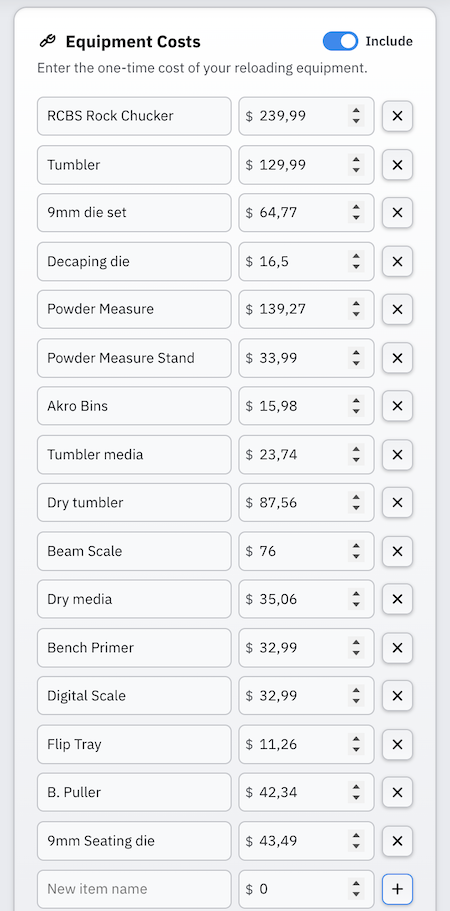

### 6.3 Reading the Chart & Stats

The **stats bar** across the middle column shows the main values used in the break-even calculation:

| Stat | Meaning |
|------|---------|
| **Avg Reload Cost** | Average cost per round across selected reload entries |
| **Avg Factory Cost** | Average cost per round across selected factory entries |
| **Savings per Round** | Factory average minus reload average |
| **Break-Even Point** | Number of rounds until cumulative savings cover total equipment cost |

When **Rounds** mode is enabled for reloads, additional progress values appear:

| Stat | Meaning |
|------|---------|
| **Reload Rounds Logged** | Total effective rounds (manual baseline + journal) across all reload recipes |
| **Rounds Remaining** | How many more reload rounds are needed to reach break-even |
| **Total Savings So Far** | Current savings based on the effective reload rounds, optionally net of equipment when **Include** is enabled |

The **chart** below plots two lines:
- **Reload line**: cumulative spend including the equipment investment upfront, declining in slope as per-round costs are cheaper than factory.
- **Factory line**: cumulative spend at factory prices with no upfront cost.

The point where the lines cross is the **break-even point**, marked on the chart. After that point, every round you reload puts money back in your pocket.

In reload **Rounds** mode, the chart also shows your **current position** on the timeline based on the total effective reload rounds, making it easier to see how far along you are toward break-even.

If the reload average is higher than the factory average (reloading is more expensive per round), the lines never cross and a warning is shown.

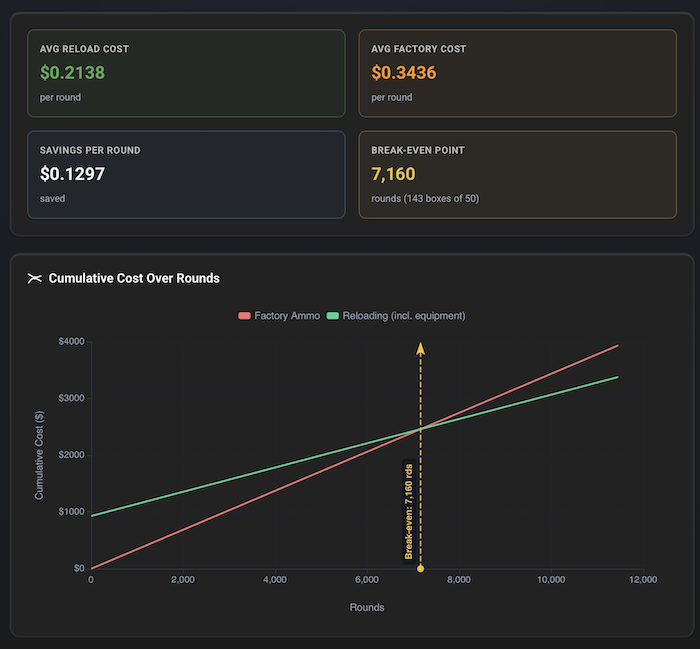

---

## 7. Cost Comparison

The **Cost Comparison** tab lets you select any combination of reload and factory entries and compare their costs side by side.

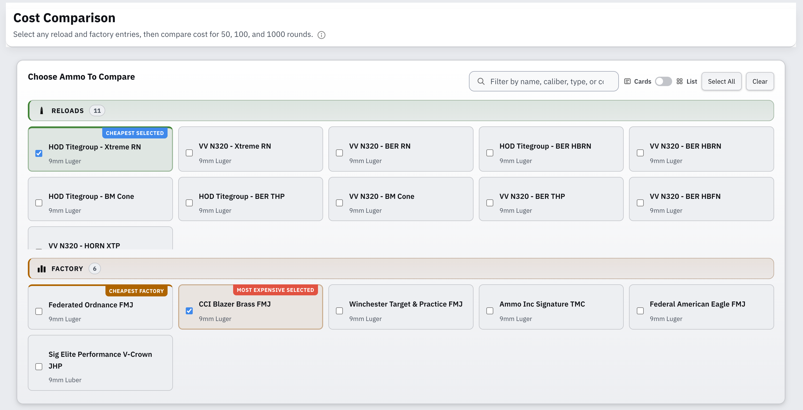

**Selecting entries**  
Click any entry in the selection list to toggle it on or off. Selected entries are highlighted: green for reloads, amber for factory ammo. You can select multiple reloads and multiple factory entries simultaneously.

**Reading the comparison**  
Once entries are selected, the view shows:

- A **bar chart** of cost per round for every selected entry.
- A **cost table** with totals for 50, 100, and 1,000 rounds for each entry.
- A **Difference** section (visible when at least one reload and one factory entry are selected) showing how much cheaper your reload is per round, per 50, per 100, and per 1,000 rounds.

Use the **Search** box above the selection list to filter by name, caliber, type, or component.

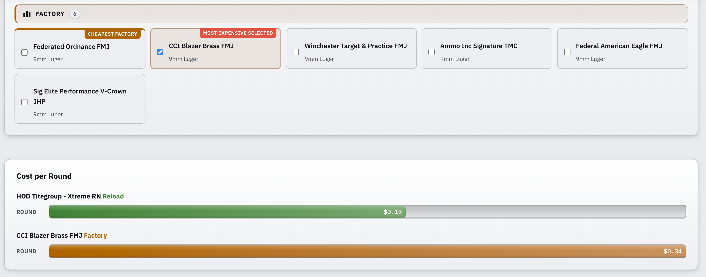
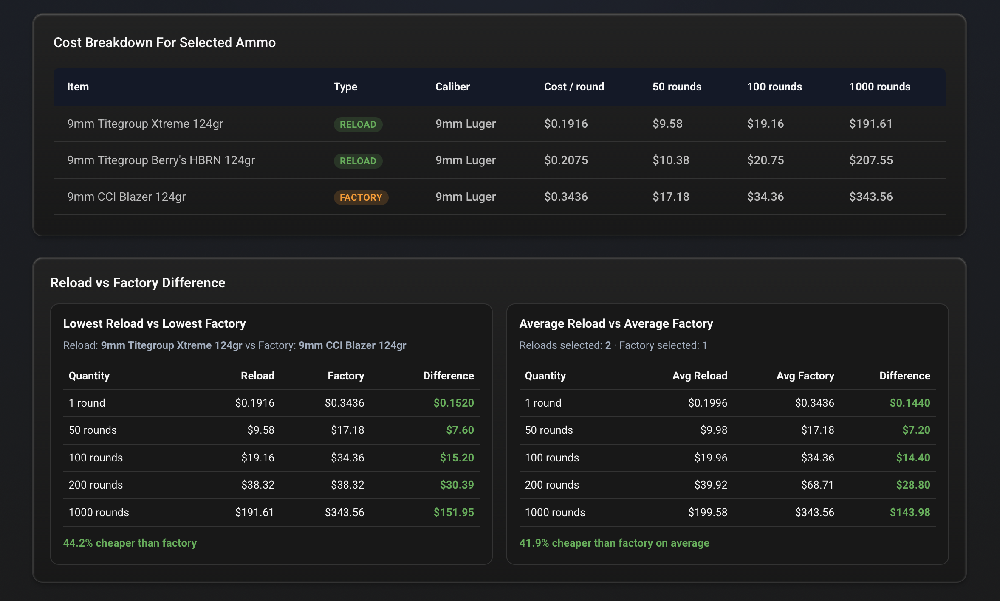

---

## 8. Guided Tour

Click **Tour** in the top navigation bar to start the built-in walkthrough at any time.

The guided tour highlights the major parts of the application and explains:

- how to add and manage ammo entries
- how to use the inventory and linked components
- how to log pressing sessions in the Journal and assign lot numbers
- how to record range sessions in the Range Log and track lot performance in the field
- how to compare reloads and factory ammo
- how to use the break-even analysis
- how to switch between simple selection and reload round-count analysis
- which values to check in the analysis stats cards

The tour can be dismissed at any time and is designed to help first-time users get oriented quickly.

---

## 9. Settings & About

The top-right area of the header includes both an **About** button and a **Settings** button.

**Settings**
- **Follow Time Of Day**: automatically uses the light theme during the day and dark theme in the evening
- **Currency Symbol**: changes the currency shown across cards, tables, and analysis views
- **Cost Per Round Decimals**: controls how many decimal places are shown for per-round costs

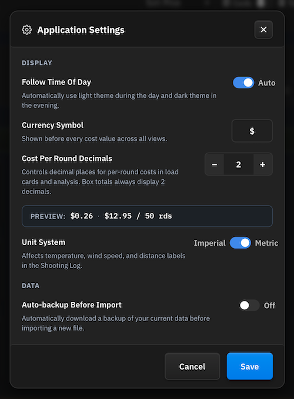

The application still defaults to the **dark theme** on first launch. If you enable **Follow Time Of Day**, the app will switch themes automatically based on the time of day. You can still use the theme toggle in the header to return immediately to manual light/dark mode.

---

## 10. Import & Export

Your entire library (ammo entries, tax defaults, equipment costs, load selections, component inventory, and your full reloading journal) can be saved to a single JSON file and restored later or shared with another computer.

**Exporting**  
Click **Export** in the top navigation bar. A `.json` file will be downloaded to your machine.

**Importing**  
Click **Import** and select a previously exported `.json` file. All data in the file will replace the current library.

> WARNING: Import overwrites your current data. Export first if you want to keep your existing entries.

---

## 11. Tips & Notes

- **All data is stored locally.** No account or internet connection is required. Data is saved automatically in the browser/app storage every time you make a change.
- **Brass reuse count matters.** Setting a realistic reuse count (commonly 5–10 reloads per case) significantly lowers your per-round brass cost. A count of 1 treats every case as single-use.
- **State Excise Tax (SET).** Factory ammunition in some US States is subject to a state excise tax in addition to state and local sales tax. The default value is pre-filled for you.
- **Fix Fee (FF).** Some US States have an additional fix fee (normally associated to a background check) on any ammunition purchases. This is a fixed fee applied to the entire purchase and its cost is diluted over all the rounds purchased.
- **Accuracy of results.** All costs are estimates based on the prices you enter. Check current component and ammo prices regularly, as they fluctuate.
- **Use load status to manage your library lifecycle.** Mark new recipes as **Draft** while you are costing them out, move them to **In Development** once you are working them up at the range, promote to **Active** when proven, and **Retire** recipes that have been superseded. Retired loads disappear from default views without losing any journal history.
- **Duplicating entries** is a quick way to model variants: duplicate a load, change the powder charge or bullet weight, and compare side by side in the Cost Comparison tab.
- **Equipment costs** only need to be entered once. They persist between sessions and are included in export files.
- **Use the inventory for shared components.** If you load multiple calibers with the same powder or primer, define it once in My Components and link it to all relevant loads. A single price update flows through everywhere.
- **Inventory lists are alphabetical.** Components inside each inventory group are ordered by name to make powders, primers, bullets, and brass easier to scan.
- **Powder quantity field.** When entering a powder in the inventory, set the quantity to match how the powder is sold (1 lb, 4 lb, 8 lb, etc.). The app calculates the per-lb rate automatically and uses it when costing a load.
- **Unlinking a component.** Manually editing any field in a linked component section (name, price, quantity) automatically breaks the inventory link. The load keeps the values you typed but is no longer updated when the inventory item changes. Use the **×** on the badge to unlink without changing any values.
- **Deleting an inventory item** does not delete any loads that used it. Those loads retain the component values they had at the time the link was broken.
- **Journal lot numbers never repeat.** Deleting an entry does not reuse its lot number. The next new entry starts from the **Starting lot #** you configured in the Journal header, then increments past any already-used numbers until it finds the next free slot. This means you can lower the starting lot number to fill in historical batches without creating duplicates, and existing entries are never displaced.
- **Journal baseline for existing reloaders.** If you were reloading before you started using the journal, enter your historical round count as the manual baseline in Cost Analysis Rounds mode. The journal will add to it going forward, keeping your break-even progress accurate.
- **Label printing from the journal.** The quickest way to print a box label is directly from the Journal; the lot number and quantity are already filled in. You only need to confirm and print.
- **The bench-to-range loop.** Use the Journal to record what you pressed, then use the Range Log to record how each lot performed at the range. The two tabs together give you a complete picture: production history in the Journal, field performance in the Range Log.
- **Multiple lots in one range session.** A single range session can include several lots — for example if you ran three different powder charges side by side. Add one lot entry per charge weight so each gets its own round count and notes.
- **Range Log notes for load development.** Use the per-lot notes field in the Range Log to record group sizes, point of impact shifts, felt recoil, or function issues. Over time this builds a development log you can cross-reference when adjusting a recipe.
- **Star your reference loads.** Once you find a load that functions and groups well, star that range session. The starred filter gives you a quick shortlist when you are deciding what to press next.
- **Range Log data is included in export files.** When you export your library, your full range log history is included. Import it on another machine and your field records move with you.
