# Reloading Tracker 2.6.6: User Guide

Reloading Tracker is your complete bench-to-range companion. It starts as a production log: define your loads, record every pressing session with a unique lot number, and print a label for every box on your shelf. And it grows with you from there.

Manage a shared component inventory, work up new loads with a structured charge ladder, and log velocity and group-size results from the range until the data tells you which charge wins. Maintain a registry of your firearms so every range session is tied to a consistent gun profile. Track every range trip in the Range Log, star your best sessions, and watch remaining rounds tick down as you burn through each lot. Upload target photos, mark impacts, and get instant group statistics (extreme spread, mean radius, CEP50, windage and elevation offset), with support for colour-coded groups when you're comparing loads on the same paper.

If you also care about the economics, the app can do that too. Compare the cost of your reloads against factory ammunition, track your progress toward break-even after equipment investment, and get a side-by-side cost breakdown across any combination of loads. Totally optional though -- plenty of reloaders just want the log and the data.

[Try it out](https://fmalpartida.github.io/reloading-cost-calculator)

Enjoying Reloading Tracker? Every cup of coffee you send my way helps keep the powder flowing (new features, bug fixes, and late-night coding sessions all run on caffeine). If this app has saved you time at the bench (or saved you from a spreadsheet nightmare), consider buying me one!

## ⚠️ IMPORTANT SAFETY DISCLAIMER ⚠️

> **WARNING: DO NOT USE THE LOAD DATA IN THIS GUIDE.**
>
> Any load recipe shown in this guide (powder charges, bullet weights, COALs, or any other reloading data) is for **illustration purposes only**. These values are **not safe for use** in actual reloading.
>
> **Always build your loads from reliable, published reloading data** from reputable sources such as powder manufacturers, bullet manufacturers, or established reloading manuals. Never copy load data from screenshots, examples, or guides like this one.
>
> Improper reloading can result in serious injury, death, or property damage.

---

## Table of Contents

1. [Overview](#1-overview)
   - [Recommended Workflow](#recommended-workflow)
   - [Tabs at a Glance](#tabs-at-a-glance)
2. [My Ammo](#2-my-ammo)
   - [Adding a Reload Entry](#21-adding-a-reload-entry)
   - [Adding a Factory Ammo Entry](#22-adding-a-factory-ammo-entry)
   - [Managing Entries](#23-managing-entries)
   - [Load Status](#load-status)
   - [Default Taxes & Fees](#24-default-taxes--fees)
   - [Charge Workup (Load Development)](#25-charge-workup-load-development)
3. [My Components](#3-my-components)
   - [Adding a Component](#31-adding-a-component)
   - [Managing Components](#32-managing-components)
   - [Linking Inventory to Loads](#33-linking-inventory-to-loads)
4. [Firearms Registry](#4-firearms-registry)
   - [Adding a Firearm Profile](#41-adding-a-firearm-profile)
   - [Managing Firearm Profiles](#42-managing-firearm-profiles)
   - [Filtering and Searching](#43-filtering-and-searching)
   - [Card and Table Views](#44-card-and-table-views)
5. [Reloading Journal](#5-reloading-journal)
   - [Logging a Session](#51-logging-a-session)
   - [Managing Journal Entries](#52-managing-journal-entries)
   - [Printing a Lot Label](#53-printing-a-lot-label)
   - [Journal Statistics](#54-journal-statistics)
6. [Range Log](#6-range-log)
   - [Logging a Range Session](#61-logging-a-range-session)
   - [Managing Range Sessions](#62-managing-range-sessions)
   - [Starring Sessions](#63-starring-sessions)
   - [Range Log Statistics](#64-range-log-statistics)
7. [Targets](#7-targets)
   - [Target Analysis](#71-target-analysis-sub-tab)
     - [Creating a Target Record](#711-creating-a-target-record)
     - [Uploading and Calibrating the Image](#712-uploading-and-calibrating-the-image)
     - [Marking Impacts and Point of Aim](#713-marking-impacts-and-point-of-aim)
     - [Statistics Panel](#714-statistics-panel)
     - [Working with Groups](#715-working-with-groups)
     - [Aggregate View](#716-aggregate-view)
     - [Linking to a Range Session](#717-linking-to-a-range-session)
     - [Printing a Target](#718-printing-a-target)
   - [Compare](#72-compare-sub-tab)
   - [Target Generator](#73-target-generator-sub-tab)
     - [Creating a Target Sheet](#731-creating-a-target-sheet)
     - [Configuring Rings](#732-configuring-rings)
     - [Layout, Page Size, and Grid](#733-layout-page-size-and-grid)
     - [Annotations](#734-annotations)
     - [Managing Target Sheets](#735-managing-target-sheets)
     - [Printing a Target Sheet](#736-printing-a-target-sheet)
8. [Cost Analysis (Break-Even)](#8-cost-analysis-break-even)
   - [Load Selection](#81-load-selection)
   - [Equipment Costs](#82-equipment-costs)
   - [Reading the Chart & Stats](#83-reading-the-chart--stats)
9. [Cost Comparison](#9-cost-comparison)
10. [Guided Tour](#10-guided-tour)
11. [Settings & About](#11-settings--about)
12. [Import & Export](#12-import--export)
13. [Tips & Notes](#13-tips--notes)

---

## 1. Overview

### Recommended Workflow

Reloading Tracker follows a natural progression that mirrors the way reloading actually works. The first three steps are the core workflow, useful for any reloader regardless of whether you care about costs. Step 4 is for those who also want to track cost and break-even progress.

<!-- IMAGE MAY NEED UPDATING: navigation bar now includes the Firearms tab between My Components and Journal -->

**Step 1: Define your loads**

Before you can log sessions, the application needs to know what you are reloading. You have two ways to add a load:

- **Direct entry in My Ammo.** Open the Editor tab and fill in the load details. This is the fastest way to get started.
- **Build a component library first (recommended).** Go to **My Components** and add your powders, primers, bullets, and brass. Then, when you create a load in My Ammo, select each component from the inventory instead of typing values by hand. Any future price change (a new jug of powder, a bulk primer buy) only needs to be updated in one place, and every load that uses that component recalculates automatically.

> **If you plan to use the cost features**, accuracy starts with the prices you enter. Use the actual prices you paid, including shipping if it meaningfully affects the per-unit cost. Update component prices when you buy a new batch. The closer your entries are to real-world costs, the more the numbers you see will reflect your true reloading economics rather than a rough estimate.

If you use Cost Analysis or Cost Comparison, also add at least one **factory ammo** entry (with its box price, taxes, and any fixed fees) so the comparison and break-even analysis have a meaningful baseline to work against.

**Step 2a (optional): Work up a new load**

If you are developing a new load from scratch, set its status to **In Development** and configure a **Charge Ladder** in the Editor. Then open the **Charge Workup** panel (ladder icon on the load card or table row) to manage the full development cycle: plan charges, batch-log pressing sessions, track velocity and accuracy results from the range, and promote the winning charge to your final load definition when done. See [Charge Workup](#25-charge-workup-load-development) for the full workflow.

**Step 2b: Log your pressing sessions in the Journal**

Every time you sit down at the press, open the **Journal** tab and add an entry: select the load, enter the date and the number of rounds you produced. The application assigns a unique, incrementing lot number automatically.

This is where the application starts working for you over time. Each session builds a complete production history: what you made, when you made it, and how much. That record is valuable on its own as a traceable log of every batch you have ever pressed, and it also feeds directly into Cost Analysis if you want to track your progress toward break-even.

**Step 3: Print lot labels**

After logging a pressing session, click the **Print** button on the journal entry. The label dialog opens with the lot number and quantity already filled in from the session. Review the label (load name, caliber, components, COAL) and print. Attach it to the ammo box before it goes on the shelf. Every box in your storage is now traceable back to a specific lot in the journal. You can also print an additional label for your reloading log book.

**Step 4: Take it to the range and log the session**

After a range trip, open the **Range Log** tab and add a session: choose the firearm you used, the date, the distance you shot, and the lots you burned through. You can record multiple lots in a single outing, each with its own round count, charge weight, COAL, and notes, so each lot tells you exactly how it performed at the range.

The firearm selector in the Range Log form draws from the **Firearms Registry** (the Firearms tab). Any firearm you have profiled there appears in the dropdown, so you never have to type the same name twice and your performance data stays tied to a consistent firearm identity. If you log a session with a firearm name that does not yet exist in the registry, it is added automatically as a minimal profile that you can flesh out later in the Firearms tab.

Over time the Range Log becomes a searchable field record that connects every range session to the specific lots and load recipes that produced it. Star sessions that produced exceptional results so you can find them later; use the starred filter to pull up only your reference loads when you are at the bench deciding what to reload next.

> **The bench-to-range loop.** The Journal and the Range Log together close the loop on every batch of ammo you press. The Journal tells you what you made and when. The Range Log tells you how each lot performed when it counted. Together, they make it straightforward to decide which loads are worth pressing again and which recipes to refine.

**Step 4b (optional): Analyse your target**

After a range session, open the **Targets** tab. The tab has three sub-tabs:

- **Target Analysis**: create a new target record, upload a photo, calibrate the scale using a known reference distance, and mark each bullet impact. The application computes group statistics (extreme spread, mean radius, CEP50, windage and elevation offset from your point of aim, and more) immediately as you place shots. When you have multiple loads or charges on the same target, organise impacts into colour-coded groups to compare each group independently and view aggregate statistics across all groups. Link the target record to the range session to navigate between the two tabs with a single click.
- **Compare**: after linking targets to sessions, the Compare sub-tab aggregates every linked result in one table. Filter by load to instantly see which charge weight delivered the best group size and most consistent velocity across all your range sessions.
- **Target Generator**: design and print custom target sheets before your range session. Configure concentric scoring rings, choose colours and sizes, set columns and rows for multi-target layouts, add grid overlays, and annotate each slot with the load and firearm you plan to use. Print directly from the application and bring your designed targets to the range.

**Step 5 (optional): Review your costs and track break-even**

With pressing sessions accumulating in the journal, open **Cost Analysis** and switch to **Rounds** mode. Your journal rounds are automatically added to your reload entries. Watch the break-even chart as your position on the reload line advances toward the intersection with factory costs. The stats panel shows you exactly how many rounds remain until your equipment pays for itself, and how much you have already saved.

Use **Cost Comparison** at any time to see side-by-side which of your loads is the most economical, or to check whether a specific factory ammo purchase would have been cheaper than your reload for that caliber.

---

The more consistently you log your sessions, the more the application rewards you. A year of journal and range-log entries is both a complete production and performance record of every lot you have ever pressed and, if you use the cost features, a genuine financial picture of what reloading saves you.

---

### Tabs at a Glance

The application has seven main tabs accessible from the navigation bar at the top:

| Tab | Purpose |
|-----|---------|
| **My Ammo** | Library of all your ammo entries: reloads and factory |
| **My Components** | Global catalog of reloading components: powders, primers, bullets, and brass |
| **Firearms** | Registry of your firearm profiles: type, caliber, action, barrel, and twist data |
| **Journal** | Log pressing sessions with auto-incrementing lot numbers, dates, quantities, and notes |
| **Range Log** | Record range sessions: firearm, distance, lots fired, round counts, performance notes |
| **Targets** | Three sub-tabs: **Target Analysis**: upload target photos, mark impacts, measure group statistics, and link to range sessions; **Compare**: cross-target table of linked sessions, filterable by load, with ES, MV, SD, group size, and a summary bar showing best results per load; **Target Generator**: design and print custom target sheets with configurable scoring rings, grid overlays, and load annotations |
| **Cost Tools** | Break-even chart showing when reloading pays off after equipment investment & Side-by-side cost breakdown for selected reload and factory entries |

An **Editor** tab appears automatically whenever you are adding or editing an ammo entry.

There are also built-in **Tour**, **About**, and **Settings** controls in the top navigation area. Tour launches a guided walkthrough of the main areas of the application, About shows application/version/author/license information, and Settings lets you adjust display preferences such as theme behavior, currency symbol, and cost precision.

<!-- IMAGE MAY NEED UPDATING: navigation bar now includes the Firearms tab between My Components and Journal -->

---

## 2. My Ammo

The **My Ammo** tab is where you build and maintain your ammunition library. Entries are grouped by type: reloads first, then factory ammo (sorted cheapest to most expensive within each group). Each group has a colored section header with a **+** button to add a new entry of that type directly.

### 2.1 Adding a Reload Entry

Click **Add Ammo** in the top-right corner of the My Ammo tab, or click the **+** button in the **Reloads** section header. The Editor tab will open with **Reload** pre-selected as the load type. Fill in the following sections:

**Ammo Information**
- **Name**: identifies the cartridge. Required.
- **Load Type**: Reload or Factory.
- **Status**: the development state of the load. See [Load Status](#load-status) below.
- **Caliber**: the cartridge designation (e.g. *9mm Luger*, *.308 Win*). This is added when defining the bullet.
- **COAL**: cartridge overall length for this load. Printed on the lot label.
- **Notes**: optional free-text field for dates or any other reference.

**Powder**
- Powder name, measurement system (Imperial grains or Metric grams), price per lb/kg, and charge weight per round.

**Primers**
- Primer name, price, and the quantity that price covers (default 100).

**Bullets / Projectiles**
- Bullet description, weight, diameter, caliber, price, and quantity (default 100).

**Brass / Cases**
- Brass description, price, quantity, and how many times each case will be reloaded before replacement. The cost per round is divided by this reuse count.

**Sales Tax**
- The sales tax percentage applied to your total component cost.

A **Live Preview** panel on the right updates in real time as you type, showing the per-round cost breakdown and totals for 50, 100, and 1000 rounds.

Click **Save Load** or **Update Load** when done. The entry appears immediately in My Ammo and becomes available in Cost Comparison and Cost Analysis.

### 2.2 Adding a Factory Ammo Entry

Click **Add Ammo** or the **+** button in the **Factory** section header. The Editor opens with **Factory Ammo** pre-selected. The form shows:

**Base Factory Price**
- Price per box and rounds per box.

**Factory Taxes**
- Sales tax (%), State excise tax (%).

**Additional Fixed Cost**
- A flat fee spread over a number of rounds, useful for background check fees (e.g. $25 over 500 rounds = $0.05/rd extra) if applicable in your State.

### 2.3 Managing Ammo Entries

Each ammo card has four action buttons in its top-right corner:

| Button | Action |
|--------|--------|
| ✏️ Edit | Opens the entry in the Editor tab |
| ⧉ Duplicate | Creates a copy of the entry (useful for variants of the same load) |
| 🖨 Print | Opens the label print dialog for this load, without a pre-filled lot number or quantity |
| 🗑 Delete | Permanently removes the entry |

Click the **▸ / ▾** chevron on the left of the action buttons to expand a card and see the full component cost breakdown.

Use the **Search** box to filter cards by name, caliber, type, or component name.

You can also switch between **Card** and **Table** views using the view toggle next to the search box. Card view shows the familiar expandable cards, while Table view gives you a denser list that is easier to scan when you have many entries.

### Load Status

Every ammo entry carries a **status** that describes where it is in your development cycle. The status badge appears on each card and in the table's Status column.

| Status | Meaning |
|--------|---------|
| **Draft** | Entered for cost estimation only; not yet range-verified. Cards show a dashed border as a visual reminder. |
| **In Development** | Actively being worked up at the bench or range. Eligible for Journal logging. Unlocks the **Charge Ladder Setup** section in the Editor and the **Charge Workup** panel on the load card. |
| **Active** | Proven load, ready to press. Eligible for Journal logging. |
| **Retired** | Recipe superseded or no longer in use. Hidden from default views but preserved in all history and journal entries. |

**Changing the status**
- In card view: expand the card (▸) and use the **Status** selector at the top of the expanded body.
- In table view: use the **Status** dropdown in the Status column.
- In the Editor: the Status field appears in the Ammo Information section next to the load type.

 

**Retired loads**
Retired entries are hidden by default to keep your active library clean. When a section (Reloads or Factory) contains retired entries, a **"N retired"** link appears in that section's header bar next to the count. Click it to reveal retired loads; click **"hide retired"** to collapse them again.

> **Journal and Range Log entries are never affected by status changes.** A retired load's history is fully preserved; only its visibility in the active library changes.

### 2.5 Charge Workup (Load Development)

The **Charge Workup** panel is the built-in load development workflow. It lets you plan a charge ladder, batch-log pressing sessions directly from the panel, track velocity and group-size results for each step, and promote the winning charge to your final load, all without leaving the application.

#### Setting up a charge ladder

1. Create or edit a reload entry and set **Status** to **In Development**.
2. A **Charge Ladder Setup** section appears at the bottom of the Editor form. Fill in:

| Field | Description |
|-------|-------------|
| **Min charge** | Starting charge in your ladder (e.g. 38.0 gr) |
| **Max charge** | Upper bound of the ladder (e.g. 42.0 gr) |
| **Step size** | Increment between each step (e.g. 0.5 gr) |
| **Rounds per step** | How many rounds to press at each charge weight (e.g. 20) |

3. Save the load. A **ladder icon (⟑)** now appears on the load card and in the table's action column.

#### The Charge Workup panel

Click the ladder icon to open the **Charge Workup** panel. It contains three main areas:

**Load info bar**

Shows the load name, caliber, and the configured ladder range (e.g. *38.0–42.0 gr · step 0.5 gr · 20 rds/step*). While the load is In Development, a small pencil button lets you edit the min/max/step/rounds directly in the bar without going back to the Editor. If a charge has been promoted, a green *Promoted: X gr* badge appears.

**Charge ladder table**

Every step in the ladder is listed as a row: planned steps (not yet pressed) and fired steps with accumulated data.

| Column | Description |
|--------|-------------|
| ☐ | Checkbox to include this charge in the next batch log |
| **Charge** | The charge weight; a ✓ badge marks the promoted charge |
| **Lot(s)** | Lot number chips for each journal entry at this charge |
| **Qty** | Total rounds pressed at this charge |
| **Sessions** | Number of range sessions that include these lots |
| **Avg fps** | Average muzzle velocity across all sessions for this charge |
| **Avg SD** | Average standard deviation |
| **Best Group** | Best (smallest) group size recorded at this charge |
| **Promote** | Button to promote this charge as the final load (only shown when data exists and the load is In Development) |

Rows with data but not yet promoted are highlighted with a subtle tint. The promoted row is highlighted in green.

**Logging entries from the workup panel**

All plannable steps are checked by default. Uncheck any step you do not want to press in this session, then click **Log N Entries** in the footer. The application creates one Journal entry per checked charge, all dated today, using the configured rounds per step. A brief confirmation message appears before the panel closes.

> You can also add a **one-off charge** that is outside the configured ladder: type the charge weight in the *Add charge* field below the table and click **Add**. The row appears in the table, checked and ready to include in the next batch log, without immediately writing a journal entry.

**Performance chart**

Once at least two steps have been fired and recorded in the Range Log, a chart appears below the table:

- **Avg fps** (solid blue line, left axis): average muzzle velocity per charge weight.
- **Lot fps** (blue diamonds): individual lot velocity, one diamond per journal entry; shows the spread at each charge when multiple lots have been fired.
- **Best Group** (dashed amber line, right axis, inverted): the best group size at each charge. The axis is inverted so smaller groups (better accuracy) appear higher on the chart.
- **Lot Group** (amber diamonds): individual lot group sizes.

Hover over any line point to see the value; hover over a diamond to see which lot it belongs to. 

#### Promoting a charge

When the data shows a clear node (a charge with consistently good velocity SD and small groups), click **Promote** on that row. A confirmation dialog shows the charge being promoted.

Confirming promotion:
- Sets the load's **powder charge** to the promoted value.
- Changes the load's status to **Active**.
- **Stars** all Journal entries for the promoted charge so they are easy to find in the Journal and Range Log.
- **Unstars** any entries that belonged to a previously promoted charge (on re-promotion).

The load is now an active, proven recipe and the Charge Workup panel switches to a history view showing the full development record.

#### Starting a new development cycle

If you want to refine the load further, open the workup panel and use the **In Dev / Active** toggle in the footer. This returns the load to In Development status without clearing any data. You can then adjust the ladder range, add new steps, or press additional lots at charges of interest.

#### Workup data in the printed data sheet

When you print a load's **Data Sheet** from the My Ammo print options, the Charge Workup section is automatically included if development data is present. The printed output shows the ladder summary, the full charge table with the promoted step marked, and a copy of the performance chart as an embedded image.

---

### 2.4 Default Taxes & Fees

At the top of My Ammo there is a **Default Taxes** panel. Values set here are used to pre-populate the tax fields whenever you create a new entry, saving repetitive data entry.

- **Reload**: sales tax percentage applied to reload component costs.
- **Factory**: sales tax %, excise tax %, fixed fee amount, and the number of rounds that fee covers.

Click **Apply to All** to update every existing entry in your library with the current defaults at once.

You can also reset taxes to defaults on a per-entry basis using the **Reset to defaults** link inside the Editor.

---

## 3. My Components

The **My Components** tab is a global catalog of reloading components. Instead of typing the same powder name, price, and quantity into every load, you define each component once here and then select it from a dropdown when editing any reload. If a component price changes, update it in the inventory and every linked load updates automatically.

Components are organised into four types: **Powder**, **Primer**, **Bullet**, and **Brass**. They are displayed in grouped sections, each with a colored left-border accent that matches the component's icon.

**Filter tags** at the top of the list let you narrow the view to a single type at a glance; click a tag to activate it, click again to clear the filter.

Use the **Search** box to filter components by name or notes across all groups.

Like My Ammo, My Components also supports **Card** and **Table** views through the view toggle near the search box.

### 3.1 Adding a Component

Click **Add Component** in the top-right corner, or click the small **+** button in any group header to pre-select that component type.

**Component Type**  
Choose one of the four types using the selector buttons at the top of the form. Once a component is saved the type cannot be changed; duplicate it and delete the original if you need a different type.

**Name / Description** *(required)*  
A descriptive label, e.g. *Titegroup*, *CCI 500 Small Pistol*, *124gr FMJ RN*, *Mixed once-fired 9mm*.

**Price** *(required)*  
The price you paid for the component. For powders this is the price per pound (Imperial) or per kilogram (Metric). For all other types it is the total price for the quantity below.

**Quantity / Weight** *(required)*  
- *Powder*: the weight the price covers (lbs or kg). A 1 lb jug entered at $28.99/1 lb stores as $28.99/lb; a 4 lb jug entered at $89.99/4 lb also resolves to the correct per-lb rate when used in a load.
- *Primer, Bullet, Brass*: the number of units the price covers (e.g. 100 primers for $15.99).

**Measurement System** *(powder only)*  
Select **Imperial (lb)** or **Metric (kg)**. This carries through to any load that links to this powder.

**Times Reloaded** *(brass only)*  
How many reloads each case is expected to survive before replacement. This amortises the brass cost across that many rounds.

**Notes**  
Optional free-text field for lot numbers, suppliers, or any other reference.

**Stock on hand** *(optional)*  
The current quantity you have in stock. The unit depends on the component type:
- *Powder*: weight in lb or kg (matching the measurement system you selected)
- *Primer, Bullet, Brass*: individual count

Leave this field blank if you do not want to track stock for this component. Only components with a stock quantity set are visible to the journal deduction feature.

**Alert below** *(optional)*  
A low-stock threshold in the same unit as **Stock on hand**. When the quantity on hand falls at or below this value, the component card shows a **Low** badge as a visual warning. This is a display indicator only; it does not block any operation.

Click **Save** to add the component. The card appears immediately in its group.

Each component card shows:
- Component name and type icon
- **Price**: the raw price as entered (e.g. *$89.99 / 4 lb*)
- **Per unit**: the derived cost per lb/kg or per single primer/bullet/case (e.g. *$22.50/lb*)
- **Stock**: current quantity on hand, shown only when a stock quantity has been entered. Powder stock is shown to four decimal places; all other types show a whole number. A **Low** badge appears inline when the quantity is at or below the configured threshold.
- Brass **Reloads** count (brass cards only)
- Bullet **caliber**, **diameter** and **weight** (bullets only)
- Notes (if any)

### 3.2 Managing Components

Each component card has three action buttons:

| Button | Action |
|--------|--------|
| ✏️ Edit | Opens the component in the form panel for editing. The type selector is disabled; type cannot be changed after creation. |
| ⧉ Duplicate | Creates a copy with *(copy)* appended to the name, useful when a component comes in multiple package sizes. |
| 🗑 Delete | Permanently removes the component from the catalog. Loads that were linked to it retain their last-known values but lose the live link. |

In **Table view**, the **Stock** column shows the current quantity on hand for each component, formatted with a unit suffix (*primers*, *rounds*, *cases*, *lb*, or *kg*). Components with no stock quantity set show a dash (—). A **Low** badge appears in the same cell when stock is at or below the threshold.

### 3.3 Linking Inventory to Loads

When editing or creating a reload in the **Editor** tab, each component section (Powder, Primers, Bullets, Brass) has a **Select from inventory** dropdown above the manual input fields. Choosing an item from that dropdown fills all the related fields automatically and marks the component with a **linked badge**.

**What the linked badge means:**  
A small inventory icon appears next to the component name to indicate the values are driven by the inventory. If you manually edit any field in that section the link is broken automatically and the badge disappears; the load then stores its own independent copy of those values.

You can also click the **×** on the badge to unlink intentionally without editing any field.

**Auto-update behaviour:**  
When you edit a component in My Components (e.g. update a powder price after buying a new jug), every reload that is still linked to that component has its cost recalculated immediately. No manual re-entry is needed.

> **Tracking cost changes across component batches.** If you want to preserve an accurate cost history when a new batch of a component arrives at a different price, add the new batch as a separate inventory item rather than editing the existing one. Then duplicate the load in My Ammo and link the copy to the new batch. Journal entries logged against the original load retain its original component costs, while the duplicate carries the new batch price going forward. Both loads appear in Cost Analysis, giving you an accurate weighted picture of what you have actually spent across batches.

**Inventory badge in My Ammo:**  
In the expanded card view under My Ammo, any component that originates from the inventory shows a small inventory icon next to its name, so you can tell at a glance which values are managed centrally.

---

## 4. Firearms Registry

The **Firearms** tab is a dedicated catalog of the firearms you own and shoot. Every firearm you add here becomes available in the Range Log session form as a selectable option, keeping your range session records consistently tied to a known firearm profile rather than free-typed names. Profiles capture the mechanical details that matter for long-range and load-development work: caliber, action type, barrel length, and twist rate.

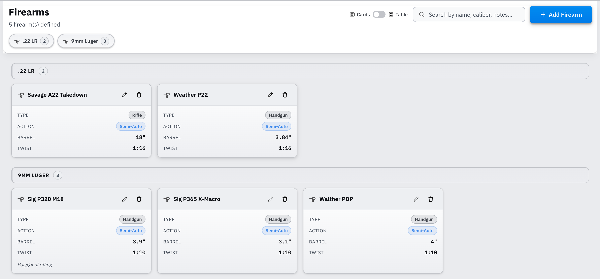

### 4.1 Adding a Firearm Profile

Click **Add Firearm** in the top-right corner of the Firearms tab. A dialog opens with the following fields:

| Field | Required | Description |
|-------|----------|-------------|
| **Name** | Yes | A descriptive label for the firearm, e.g. *Remington 700 SPS*, *Glock 17 Gen 5*. |
| **Firearm Type** | No | Broad category: **Rifle**, **Handgun**, **Shotgun**, or **Other**. |
| **Caliber** | No | The cartridge the firearm is chambered in, e.g. *.308 Win*, *9mm Luger*. Used for grouping and caliber filter chips. |
| **Action Type** | No | Operating mechanism: **Bolt**, **Semi-Auto**, **Lever**, **Pump**, **Single Shot**, **Revolver**, or **Other**. |
| **Barrel Length** | No | Free text, e.g. *24 in*, *16.5"*. |
| **Twist Rate** | No | Rifling twist rate, e.g. *1:10*, *1:8*. Relevant for bullet stabilisation in load development. |
| **Notes** | No | Any other reference: optics setup, known issues, purchase date, etc. |

Click **Add Firearm** in the dialog footer to save. The profile appears immediately in the Firearms list and becomes available in the Range Log firearm selector.

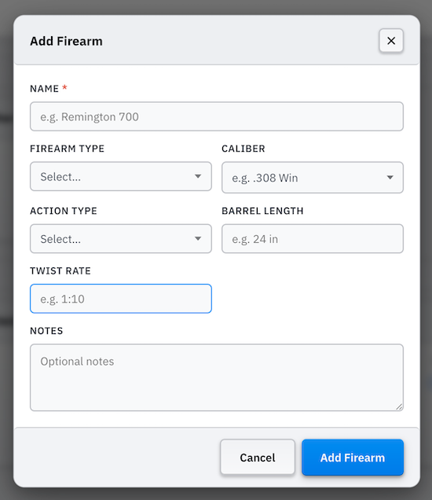

### 4.2 Managing Firearm Profiles

Each firearm profile (in both card and table view) has two action buttons:

| Button | Action |
|--------|--------|
| ✏️ Edit | Opens the profile in the form dialog for editing. All fields can be changed. |
| 🗑 Delete | Permanently removes the profile from the registry. Existing Range Log sessions that referenced this firearm are not affected; the recorded firearm name is preserved in those sessions. |

A confirmation dialog appears before deletion to prevent accidental removal.

### 4.3 Filtering and Searching

**Caliber filter chips**

When at least one profile has a caliber set, a row of **caliber filter chips** appears below the page header. Each chip shows the caliber name and a count of how many firearms are chambered in it. Click a chip to filter the list to that caliber; click it again to deselect. Multiple chips can be active at the same time, showing the union of the selected calibers.

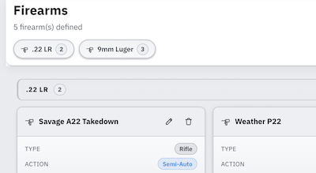

**Search**

The **Search** box in the page header filters profiles by name, caliber, and notes simultaneously. The count below the page title updates to reflect how many profiles match the current search.

Clearing the search box resets the list to all profiles (subject to any active caliber filter chips). The search and caliber chips work together; the list shows only profiles that match both the active chip selection and the search text.

### 4.4 Card and Table Views

The **Cards / Table** toggle in the page header switches the display layout. The preference is saved between sessions so the Firearms tab always opens in your last-used view.

**Card view** (default): each firearm appears as a tile showing all populated fields. Fields that were left blank are omitted from the card to keep it uncluttered. The Type badge and Action tag appear as styled chips.

**Table view**: profiles are displayed as rows in a denser layout with columns for Name, Type, Action, Barrel, Twist, and Notes. This view is more efficient for scanning a large registry at a glance.

In both views, profiles are grouped by caliber. Firearms without a caliber appear in an **Uncategorized** group at the bottom.

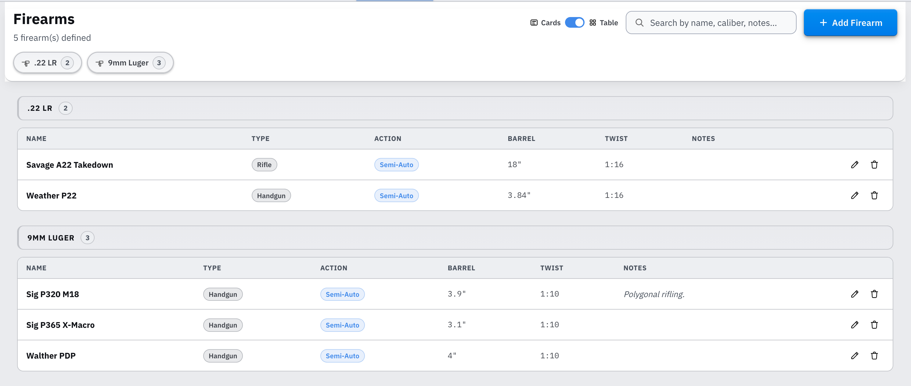

---

## 5. Reloading Journal

The **Journal** tab is the heart of the application for session-based reloaders. Every time you sit down at the press, add an entry with the load you reloaded, the quantity you produced, and the date. Each entry automatically receives a unique, incrementing **lot number** that you can print on an ammo box label. Over time, your journal becomes a complete, searchable production history of every batch you have ever pressed.

### 5.1 Logging a Session

Click **Log Entry** at the top right of the entries card to open the session dialog. Fill in:

| Field | Description |
|-------|-------------|
| **Date** | The date of the session (defaults to today). Required. |
| **Load** | Select from your Active or In Development reload entries. Required. |
| **Qty** | Number of rounds produced. Required. |
| **Charge override** | Optional. Enter a value only if this batch was loaded at a different charge than the recipe default. Overridden values are highlighted in the journal row. |
| **COAL override** | Optional. Per-lot cartridge overall length if it differs from the recipe. |
| **Brass override** | Optional. Specify which brass was used if it differs from the recipe default. |
| **Notes** | Optional; use for a powder lot number, seating depth, or any other session reference. |

The next available lot number is shown at the top of the dialog and is assigned automatically when you save. Click **Save Entry** to log the session. The new entry appears at the top of the list and the lot counter advances.

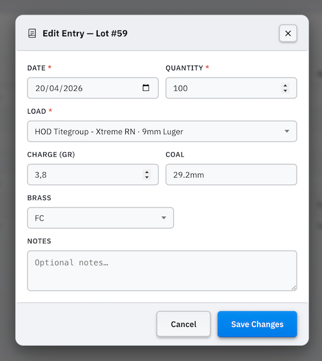

**Starting lot number**  
At the top of the summary panel (visible when the summary is expanded) you can set the **Starting lot #**. The next lot number is always the first unused number at or above this value. If you raise it above your current highest lot (for example to start a new series at 100), the next entry will begin from that number. If the requested number is already in use, the application finds the next free slot automatically, so duplicate lot numbers can never occur. Use this field to align with a lot series you were already tracking elsewhere or to create a meaningful break in your numbering when switching between projects or calibres.

### 5.2 Managing Journal Entries

Each entry row has action buttons on the right:

| Button | Action |
|--------|--------|
| ☆ Star | Marks the entry as a reference lot (starred entries show a coloured accent) |
| ✏️ Edit | Opens the entry for editing; the lot number is fixed and cannot be changed |
| ⧉ Duplicate | Creates a copy of the entry with the next available lot number (useful for pressing additional batches of the same load at the same settings) |
| 🖨 Print | Opens the label print dialog pre-filled with the lot number and quantity |
| 📦 Archive | Moves the entry to the archive so it no longer appears in the main list. Archived entries are preserved in full and can be restored at any time. |
| 🗑 Delete | Permanently removes the entry |
| 📦 Deduct from stock | Appears only when the entry's load has at least one linked inventory component with a stock quantity set. See below. |

**Deducting inventory stock from a journal entry**

When a reload entry is linked to components in My Components that have a **Stock on hand** value set, a stock deduction button (inventory icon) appears on the journal row. Click it to deduct the quantities used by that lot from the linked inventory:

| Component | Amount deducted |
|-----------|----------------|
| Powder | Weight used: `(rounds × charge in grains) ÷ 7000` lb, or `÷ 15432.4` kg for metric. If the entry has a charge override, that value is used instead of the recipe default. |
| Primer | 1 per round (`quantity`) |
| Bullet | 1 per round (`quantity`) |
| Brass | 1 per round (`quantity`). If the entry has a **Brass override**, the matching inventory item is found by name rather than by the linked ID. |

After a successful deduction, the button changes to a **✓ Stock** badge. Click the badge to **return** the stock (undo the deduction). This is useful if you made a mistake or need to adjust quantities before re-deducting.

If you **edit** a journal entry that already had stock deducted and change a quantity-affecting field (round count, charge override, or brass override), the application automatically returns the old deduction and re-applies the new one so the inventory stays accurate.

Stock deduction is not available for archived entries.

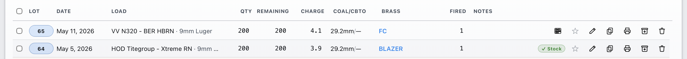

**Remaining Rounds column**
The **Remaining** column shows how many rounds from each lot have not yet been fired. It is calculated automatically from your Range Log: every time you log rounds against a lot in a range session, the remaining count decreases. When all rounds in a lot have been accounted for in the Range Log, the lot is marked **Depleted**. This live link between the journal and the range means you always know exactly how much of each lot is left on the shelf without maintaining a separate inventory.

**Archiving and restoring entries**
Click the **📦 Archive** button to move a lot out of the active list without deleting it. Archived entries remain part of your history and are still counted in the Journal statistics panel. To see archived entries, click the **"N archived"** link that appears in the journal header when any entries are archived. To restore an entry to the active list, expand the archived view and click the **Restore** button on the relevant row.

Use the **Search** box at the top of the page to filter entries by lot number, date, load name, caliber, brass name, or notes.

### 5.3 Printing a Lot Label

Click the **Print** button on any journal entry to open the label print dialog. The **LOT** and **QTY** fields are pre-filled from the entry; just confirm and print.

The label dialog lets you review and adjust every field on the label before committing:

- **Load name and caliber**, taken from the linked reload entry
- **LOT**, pre-filled with the entry's lot number
- **QTY**, pre-filled with the number of rounds logged
- All other label fields (powder, primer, bullet, brass, COAL, notes) are pulled from the load definition

You can also open the print dialog from any ammo card in **My Ammo** using the print button on that card, without a pre-filled lot number.

You can also select multiple journal entries to print their labels. Click the checkbox on the right of each journal entry to select those lables that you would like to print. Once selected click on the print button to print them. The print dialog will apear with the lables you have selected. You can also print multiple copies of them.

### 5.4 Journal Statistics

The **summary panel** on the right of the Journal tab shows:

- **Rounds by Load**: total rounds produced for each reload, sorted by volume
- **Total cost per load**: rounds multiplied by the cost per round for that load
- **Grand total rounds** and **grand total cost** across all entries

These figures accumulate automatically as you add entries. The cost per round used in the calculation is always the current cost from your load definition.

---

## 6. Range Log

The **Range Log** tab is where you record what happens after the ammo leaves the bench. Every time you go to the range, add a session: choose the firearm, enter the date and the distance, then list each lot you fired along with how many rounds and any per-lot observations. The Range Log supports all three ammo sources: lots from the Reloading Journal, manually entered reload batches, and factory ammunition. Over time it becomes a searchable field record that connects every range trip to the specific lots and load recipes that produced the ammo.

### 6.1 Logging a Range Session

Click **+ Log Session** at the top of the Range Log to open the add form. Fill in:

| Field | Description |
|-------|-------------|
| **Date** | The date of the range trip (defaults to today). Required. |
| **Firearm** | The firearm used. Select from the profiles in your **Firearms Registry** (see [Section 4](#4-firearms-registry)), or type a new name. Required. If you type a name that does not exist in the registry it is created as a minimal profile automatically; you can add its full details later in the Firearms tab. |
| **Distance** | The distance at which you shot, with a unit selector (yd / m) |
| **Temperature / Wind** | Optional session conditions |
| **Notes** | Optional free-text field for range conditions, impressions, or any other reference |

After filling in the session header, add one or more **lots** to the session using the **Lots fired** section. Each lot row has a mode toggle with three options:

| Mode | When to use |
|------|-------------|
| **From Journal** | The ammo was logged at the press in the Reloading Journal. Select the lot from the dropdown; charge and COAL fill in automatically. The rounds field pre-fills with the remaining (unfired) count from the journal, and the form will not let you log more rounds than are available. Depleted lots are hidden from the dropdown so you can never over-log a lot. |
| **Reload** | A reload batch that was not logged in the Journal. Enter an optional lot number, select the reload recipe, and override charge or COAL if needed. |
| **Factory** | Factory ammunition. Select from your defined factory entries. No charge or COAL fields are shown. |

For every lot, regardless of mode, you can also record per-lot performance data:

| Field | Description |
|-------|-------------|
| **Rounds** | Number of rounds fired from that lot |
| **Avg fps** | Average muzzle velocity |
| **ES** | Extreme spread (fps) |
| **SD** | Standard deviation (fps) |
| **Group** | Group size with unit (in / cm / MOA / MIL) |
| **Shots** | Number of shots in the group |
| **Notes** | Per-lot observations |

Use the **⧉** duplicate button on any lot row to quickly copy it when firing multiple similar lots in the same outing. At least one lot must have an ammo selection before the session can be saved.

Click **Save Session** when done. You can add as many lots as you fired during the outing.

**Velocity unit**
The **fps / m/s** toggle in the page header switches the velocity display unit for all sessions and the add/edit form at once. The preference is saved so the Range Log always opens in your chosen unit. Velocity values are always stored internally in fps; toggling the display never changes your recorded numbers.

### 6.2 Managing Range Sessions

Sessions are displayed as rows in a list, most recent first. Click any row to **expand** it and see the full per-lot breakdown for that session.

Each session row has action buttons on the right:

| Button | Action |
|--------|--------|
| ★ Star | Marks the session as a reference (see [Starring Sessions](#63-starring-sessions)) |
| ✏️ Edit | Opens the session for editing; you can change the header fields or add and remove lot entries |
| ⧉ Duplicate | Creates a copy of the session (useful for recurring outings at the same location with the same firearm) |
| 🎯 Target | Navigates to the linked target in the Targets tab. Only visible when a target has been linked to this session. |
| 🖨 Print | Opens the print dialog for the session's data sheet. If a target is linked to this session, the printed output automatically includes the annotated target image and its key statistics. |
| 🗑 Delete | Permanently removes the session and all its lot entries |

Use the **Search** box at the top of the page to filter sessions by firearm, date, lot number, or load name.

### 6.3 Starring Sessions

Click the **star button** (☆ / ★) on any session row to mark it as a reference session. Starred sessions display a coloured left-border accent so they stand out in the list.

Starring a range session also **automatically stars all journal lots** that were linked to that session via **From Journal** mode. This means the lots that produced your best results are instantly flagged in the Journal as well, so you can find them quickly at the bench when deciding what to reload next.

Click the **starred filter button** (☆) in the page header to toggle the list to show only starred sessions. This is useful when you are at the bench deciding which loads to press again and want to pull up only the sessions that produced your best results.

### 6.4 Range Log Statistics

The **statistics panel** at the top of the Range Log gives you an at-a-glance performance summary across all your recorded sessions. Click the bar to expand it.

The panel has two sections:

**Key Performance Indicators**: a row of summary tiles across the top:

| Tile | Meaning |
|------|---------|
| **Total Sessions** | Number of range sessions logged |
| **Total Rounds** | Total rounds fired across all sessions |
| **Firearms** | Number of distinct firearms used |
| **Avg FPS** | Average muzzle velocity across all lots with velocity data |
| **Best Group** | Smallest group size recorded, normalised to inches |
| **Avg Group** | Average group size across all lots with group data, normalised to inches |

**Rounds by Load**: a scrollable row of cards, one per distinct load or factory entry. Each card shows:

- Load name and total rounds fired
- Average fps and average SD (if velocity data was recorded for that load)
- Average group size and best group size (if group data was recorded for that load)

The cards let you compare performance across different loads at a glance; useful during load development to see which recipes are consistently grouping best or producing the most consistent velocity.

---

## 7. Targets

The **Targets** tab has three sub-tabs:

- **Target Analysis**: upload a photo of your target, calibrate the scale, mark bullet impacts, and get instant group statistics: extreme spread, mean radius, CEP50, windage and elevation offset, and more. When you fire multiple loads at the same aiming point, organise impacts into colour-coded groups to compare each load independently and view aggregate statistics.
- **Compare**: a sortable cross-target table that shows every target linked to a range session. Filter by load to see a summary of best ES, average MV, and best group size across all sessions for that load. Use the open button on any row to navigate directly to the target in Target Analysis.
- **Target Generator**: design and print custom target sheets from scratch. Define concentric scoring rings, set the page layout (columns × rows), choose colours and ring diameters, add grid overlays, and annotate each slot with load and firearm details before printing.

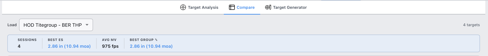

---

### 7.1 Target Analysis sub-tab

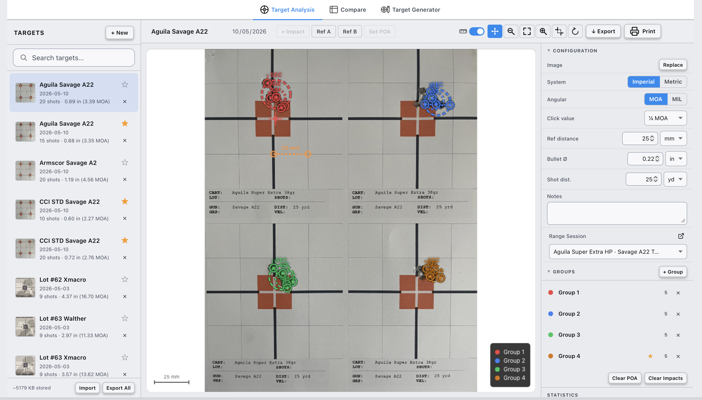

The Target Analysis sub-tab has a three-panel layout:
- **Left panel**: your list of saved target records, each showing a thumbnail, name, date, and shot count with best group size.
- **Centre**: the interactive canvas where you upload the image and place or review impacts.
- **Right sidebar**: the Configuration panel (calibration, bullet size, shot distance, notes, and range session link) and the Statistics panel (computed group metrics).

> **Unsaved changes.** If you have placed impacts or changed configuration without saving, navigating to another tab or to the Compare or Target Generator sub-tab will show a confirmation dialog so you cannot accidentally lose your work. Click **Discard & Leave** to proceed without saving, or cancel to stay.

#### 7.1.1 Creating a Target Record

Click **+ New** in the top-left header to create a new target record. A blank record opens immediately and pre-populates the measurement system from your application settings (imperial or metric). Give the record a name and date in the toolbar at the top of the canvas area.

Target records in the list show:
- A thumbnail of the uploaded target image (or a placeholder icon if no image has been uploaded yet)
- The target name and date
- Shot count and best group size

Click the **☆ / ★** star button on any list item to mark the target as a reference. Click the **✕** button to delete it (a confirmation dialog appears first).

#### 7.1.2 Uploading and Calibrating the Image

**Uploading**

Click the upload area in the centre canvas (or drag and drop an image file onto it) to load your target photo. JPEG and PNG images are supported. The image is stored locally alongside all other application data and travels with your export files.

s area showing the upload drag-drop zone before an image is loaded](./images/targets-upload-zone.png)

**Calibrating**

Before placing any shots, calibrate the pixel-to-real-world scale so the statistics are in meaningful units:

1. Select **Calibrate** from the mode buttons in the toolbar.
2. Click on the first reference point (e.g. one edge of a known dimension on the target).
3. Click on the second reference point (e.g. the opposite edge).
4. In the **Configuration** sidebar, enter the real-world distance between those two points and choose the unit (in / cm / mm).

The application uses the pixel distance between the two points divided by the entered real-world distance to derive a pixels-per-unit scale. All statistics update immediately whenever the calibration changes.

> **Tip:** Use a printed grid square, a scored ring of known diameter, or any other measurable feature on the target as your calibration reference. Write the measurement down before the session so you have it ready when you upload the photo.

**Configuration panel fields**

| Field | Description |
|-------|-------------|
| **Calibration reference** | The two reference points and their real-world distance |
| **Bullet diameter** | Diameter of the bullet fired, in inches or mm. Used to measure ES and group size from outer hole edges rather than centres |
| **Shot distance** | The distance at which the target was shot, used to compute angular values (MOA / MIL) for all statistics |
| **Measurement system** | Imperial (inches) or Metric (centimetres) output for linear statistics |
| **Angular unit** | MOA or MIL for angular statistics |
| **Click value** | Your scope's adjustment per click in the selected angular unit, used to compute how many clicks of correction are needed to move point of impact to point of aim |
| **Notes** | Optional free-text notes for this target |
| **Session** | Optional link to a range session (see [Section 7.1.7](#717-linking-to-a-range-session)) |

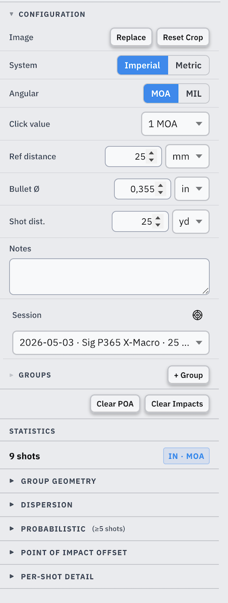

#### 7.1.3 Marking Impacts and Point of Aim

**Placing shots**

Select **Add Impact** from the mode buttons in the toolbar, then click on each bullet hole in the image. Each click places a numbered impact marker. Impacts are numbered in the order they are placed; the number is shown inside the circle.

To remove an individual impact, select **Edit** mode and click an existing marker to select it, then delete it, or use the per-impact controls in the Statistics panel.

**Setting the point of aim**

Select **Set POA** from the mode buttons, then click the point on the target you were aiming at (typically the centre of the bullseye). All offset statistics (windage, elevation, and POI distance) are measured relative to this point.

If no point of aim is set, the application uses the centroid of all shots as the reference point, and offset statistics show the deviation of each individual shot from the group centre rather than from an intended aiming point.

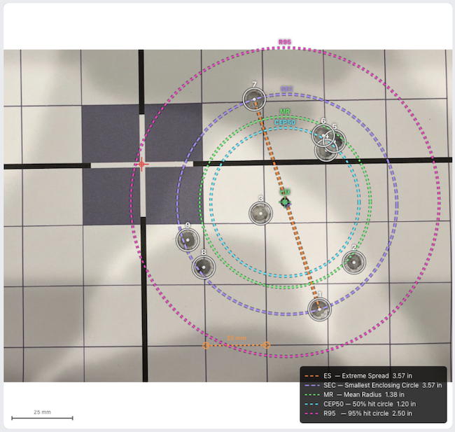

**Toolbar modes**

| Mode button | Function |
|-------------|----------|
| **Add Impact** | Click on the canvas to place a new numbered impact |
| **Set POA** | Click to place or move the point of aim marker |
| **Calibrate** | Click two reference points to set the calibration baseline |
| **Pan / Zoom** | Drag to pan the canvas; use the zoom buttons or scroll wheel to zoom in and out |

The toolbar also has **Zoom In**, **Zoom Out**, and **Fit** buttons to control the canvas view, and a **Print** button to print the annotated target (see [Section 7.1.8](#718-printing-a-target)).

#### 7.1.4 Statistics Panel

The **Statistics** panel in the right sidebar shows computed metrics for the current view (all shots, a selected group, or the aggregate). The panel is collapsible.

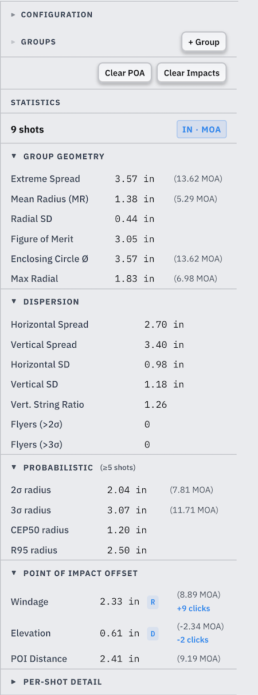

#### Group geometry

These statistics describe the physical size and shape of the group.

| Statistic | What it measures |
|-----------|-----------------|
| **Shots** | Number of impacts counted in this view |
| **Extreme Spread (ES)** | The distance between the two most widely separated holes, measured centre-to-centre (or edge-to-edge when bullet diameter is set). This is the most widely used group-size measure in practical shooting. It is a **diameter**, the full width of the group at its worst pair. Smaller is better. |
| **Smallest Enclosing Circle Ø (SEC)** | The diameter of the smallest circle that fits around all shot holes. Unlike ES, which only depends on the two worst shots, the SEC accounts for the overall spread of the group. It is always ≥ ES. |
| **Mean Radius (MR)** | The average distance from every shot to the group centroid (geometric centre). Because it uses all shots rather than just the two worst, MR is less sensitive to a single flyer than ES is. A consistent load will have a low MR relative to its ES. It is a **radius** measured from the group centre. |
| **Figure of Merit (FoM)** | The average of horizontal extreme spread and vertical extreme spread. A quick way to gauge whether the group is roughly round. |
| **Horizontal Spread / Vertical Spread** | The total width of the group on each axis independently. A much taller group than it is wide is a sign of vertical stringing. |
| **Horizontal SD / Vertical SD** | Standard deviation on each axis. A low vertical SD with a high vertical spread means the outlying shots are clustered at the extremes rather than throughout the group; a classic symptom of inconsistent muzzle velocity. |
| **Radial SD** | Standard deviation of the distance from each shot to the centroid. This is the spread of the radial distances, not the spread of X or Y positions. It is used internally as the basis for computing the Rayleigh scale parameter σ but is also a useful summary of how tightly the shots cluster around the centre. |
| **Max Radial Deviation** | Distance from the centroid to the furthest single shot. The "worst shot" metric from the group centre rather than from the worst pair. |
| **Vertical String Ratio** | Vertical spread divided by horizontal spread. A value above 1.5 is highlighted as a stringing warning; the group is significantly taller than it is wide, which often points to inconsistent muzzle velocity, trigger timing, or recoil control. |

#### Probabilistic statistics

These statistics use a statistical model to answer the question: *"If I keep firing this load, where will future shots land?"* They require at least 5 shots because small samples produce unreliable estimates.

The model used is the **Rayleigh distribution**, which describes a 2D bullet impact pattern when horizontal and vertical errors are independent and equally distributed; a reasonable assumption for a well-centred, accurate load. All probabilistic values are **radii** measured from the group centroid, not diameters.

> **Radius vs diameter.** ES is a diameter (the full spread between two holes). CEP50, R95, and the sigma radii are radii (distance from the centre). To compare them visually: if R95 = 2.5 in, the R95 circle spans 5 in across (which should be larger than the ES for a well-modelled group).

The Rayleigh scale parameter **σ** is estimated from your shots using the maximum-likelihood formula σ = √(Σrᵢ² / 2n), where rᵢ is each shot's distance from the centroid and n is the shot count. All probabilistic statistics derive from this single estimate of σ.

| Statistic | What it means |
|-----------|--------------|
| **CEP50** | Circular Error Probable at 50 %: the radius of the circle centred on the group centroid within which *half* of all future shots from the same hold are expected to land. Think of it as the median accuracy radius. A smaller CEP50 means more of your shots cluster near the centre. Value = σ × 1.177. |
| **R95** | The radius within which 95 % of future shots are expected to land. This is the practical "everything but extreme outliers" boundary. For a 10-shot group with ES = 5 in, R95 is typically larger than ES/2 (the distance from centroid to the most extreme shot). Value = σ × 2.448. |
| **2σ radius** | The circle that contains approximately 86.5 % of future shots. Shots outside this circle are counted as **Flyers (>2σ)**. Value = σ × 2. |
| **3σ radius** | The circle that contains approximately 98.9 % of future shots. Shots outside this circle are counted as **Flyers (>3σ)** and are rare statistical outliers if the load is consistent. Value = σ × 3. |
| **Flyers (>2σ)** | Count of shots whose distance from the centroid exceeds the 2σ radius (~13.5 % expected by the model). A count of 1–2 in a 10-shot group is not unusual; more than 2–3 suggests the load has inconsistent behaviour or the Rayleigh model is a poor fit. |

#### Point of impact offset

These statistics describe where the centre of the group landed relative to your intended point of aim. If no POA is set, the centroid is used as reference and all offsets will be zero.

| Statistic | What it means |
|-----------|--------------|
| **Windage offset** | How far left or right the group centre is from the point of aim, with direction label. |
| **Elevation offset** | How far up or down the group centre is from the point of aim, with direction label. |
| **POI distance** | The straight-line distance from the point of aim to the group centroid; combines both windage and elevation into one number. |
| **Clicks needed** | The number of scope clicks required to move the point of impact onto the point of aim, computed from the configured click value. Positive = move right/up; negative = move left/down. Only shown when a click value is configured. |

All linear statistics are shown in the unit selected in the Configuration panel (in or cm). When a shot distance is configured, angular equivalents (MOA or MIL) appear in parentheses next to each linear value.

#### 7.1.5 Working with Groups

Groups let you organise shots on the same target image by load, charge, or any other meaningful category, each with its own colour-coded markers and independent statistics.

**Creating a group**

Click **+ Group** in the **Groups** section of the sidebar. A new group is created with a default name and an automatically assigned colour. Click the group's name field to rename it.

Each group appears as a coloured row in the Groups list. Click a group row to select it; the canvas highlights only that group's impacts and the Statistics panel shows that group's metrics.

**Assigning shots to a group**

When one or more groups exist, each new impact you place is automatically assigned to the currently selected group. To move existing shots between groups, select **Edit** mode, click an impact to select it, and use the group selector that appears.

**Group colours**

The application assigns a distinct colour to each group automatically. Shot markers, statistics overlays (ES line, mean radius circle), and group list items all use the same colour for that group, making it easy to identify which shots belong to which load at a glance.

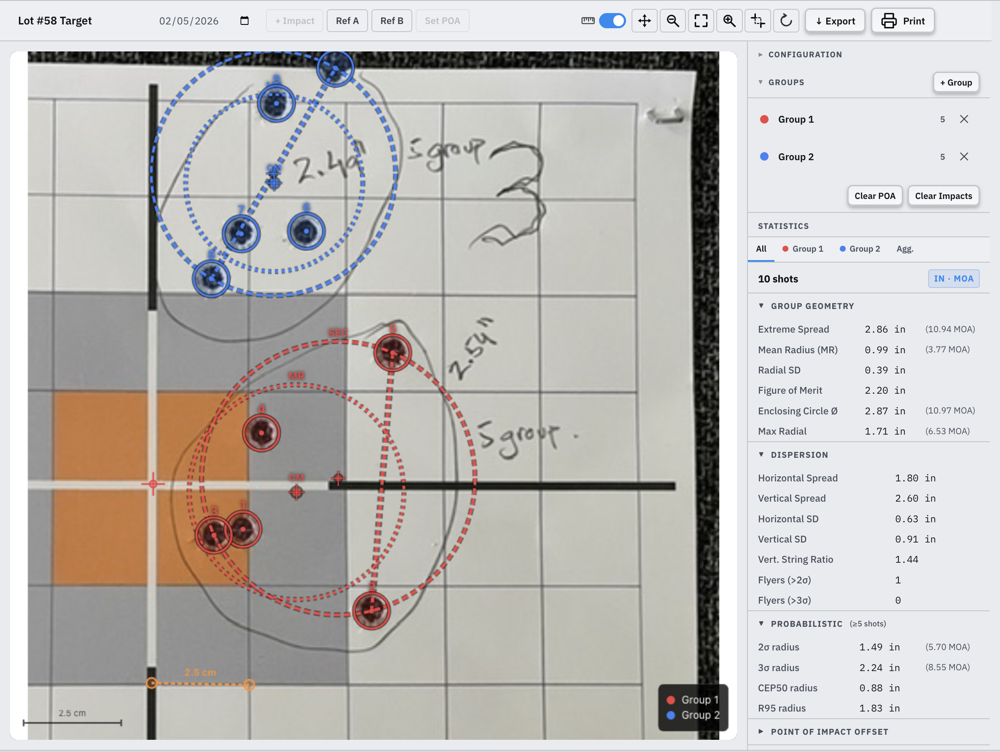

#### 7.1.6 Aggregate View

When a target has **two or more groups**, a set of view selector tabs appears above the Statistics panel:

| Tab | Description |
|-----|-------------|
| **All** | Shows all impacts on the canvas at their original positions; statistics are computed over the full shot set as if it were a single group |
| **Group name** (one per group) | Shows only that group's impacts; statistics are computed for that group alone |
| **Aggregate** | Translates each group so its centroid sits at the origin, then stacks all the re-centred shots together; statistics describe the typical dispersion of a single group, averaging across all groups |

The **Aggregate** view is particularly useful when comparing multiple loads fired at the same aiming point: it removes the POI offset between loads and focuses entirely on the consistency and group size of each load independently.

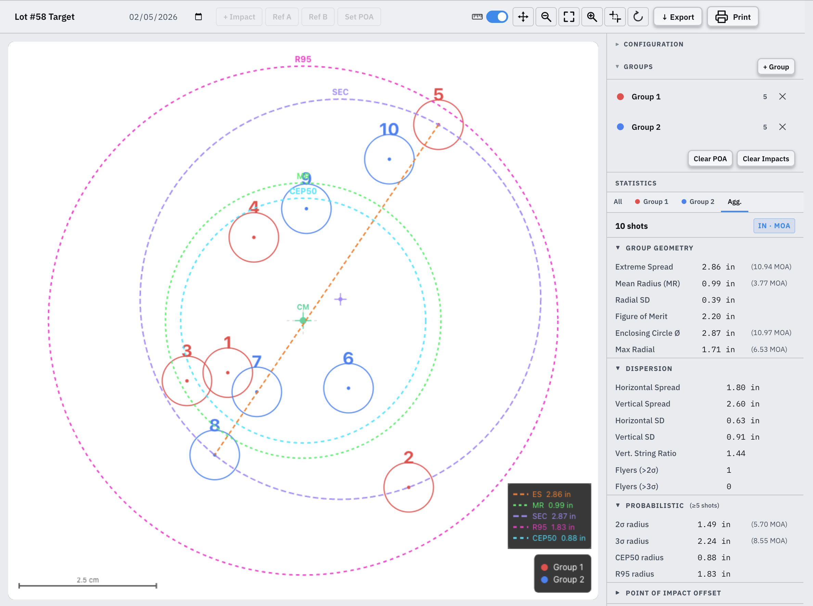

#### 7.1.7 Linking to a Range Session

In the **Configuration** sidebar, the **Session** field connects this target record to a specific range session in the Range Log. Click the field to open a searchable dropdown listing all your recorded sessions. You can search by date, firearm name, distance, or lot number.

Once linked:
- A **navigate** button (arrow icon) appears next to the session selector. Click it to jump directly to that session in the Range Log tab.
- In the Range Log, a **target icon** (scope) appears on the linked session's action buttons. Click it to jump back to this target in the Targets tab.
- When you **print** the linked range session, the printed output automatically includes the annotated target image and key statistics; no extra steps needed (see [Section 7.1.8](#718-printing-a-target) and [Section 6.2](#62-managing-range-sessions)).

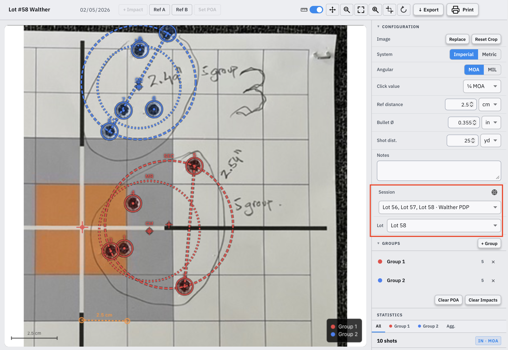

#### 7.1.8 Printing a Target

Click the **Print** button in the target toolbar to open the print output for the current view.

The printed sheet includes:
- The annotated target image with impact circles, shot order numbers, and overlay graphics: a dashed **ES line** connecting the two most extreme shots, a solid **mean radius circle**, and a dashed **CEP50 circle** (when ≥ 5 shots are present)
- The target name and view label (group name or "All Groups")
- Key statistics: shot count, extreme spread, mean radius, POI offset, and CEP50

When multiple groups are present, the view that is currently active (All, a specific group, or Aggregate) determines what is printed.

> Printing a **range session** from the Range Log automatically includes the linked target's image and statistics at the bottom of the session sheet; see [Section 6.2](#62-managing-range-sessions).

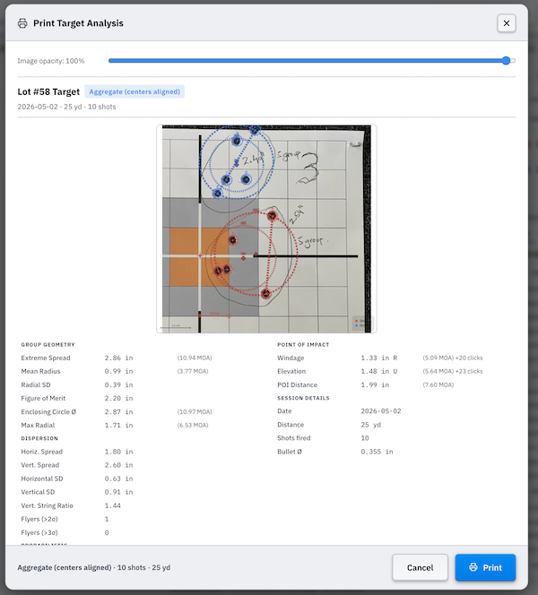

---

### 7.2 Compare sub-tab

The **Compare** sub-tab aggregates every target that has been linked to a Range Log session into a single sortable table. Where Target Analysis is for deep inspection of a single target, Compare is for answering the question across all your sessions: *which load, charge, and seating depth produced the best groups and the most consistent velocity?*

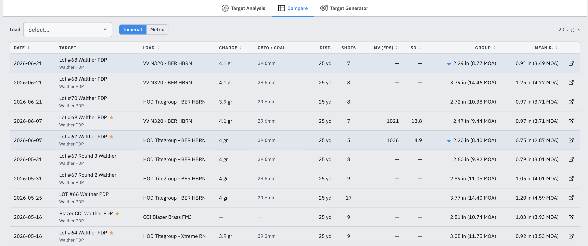

#### How rows are populated

A row appears in the Compare table for every target record that has been linked to a Range Log session (see [Section 7.1.7](#717-linking-to-a-range-session)). Targets with no session link are not shown; link a target first to include it here.

#### Columns

| Column | Source |
|--------|--------|
| **Date** | Date of the linked range session |
| **Target** | Target name; if the linked session is starred, an amber ★ appears; firearm name appears below as a subtitle |
| **Load** | Load name from the linked session lot |
| **Charge** | Charge weight from the lot (blank for factory ammo) |
| **CBTO / COAL** | Cartridge base-to-ogive / cartridge overall length from the lot (CBTO shown when available) |
| **Dist.** | Shooting distance from the range session |
| **Shots** | Number of shots recorded in the linked lot |
| **MV (fps)** | Average muzzle velocity from the range session lot |
| **SD** | Standard deviation of velocity from the range session lot |
| **ES** | Extreme spread computed from the target image in Target Analysis |
| **Mean R.** | Mean radius computed from the target image |
| **Group ✎** | Group size manually entered in the Range Log |

Click any sortable column header to sort the table by that field. Click again to reverse the sort direction.

> **ES vs Group ✎.** ES is derived automatically from the target image by the image analysis algorithm. Group ✎ is the value you typed into the Range Log session form. The two can differ slightly because the image analysis measures centre-to-centre extreme spread whereas the manually entered value may reflect a different measurement convention.

#### Filtering by load

Use the **Load** filter at the top to narrow the table to a single load. When a load is selected, a **summary bar** appears showing:

| Stat | Description |
|------|-------------|
| **Sessions** | Number of targets linked to this load |
| **Best ES** | Lowest extreme spread recorded across all targets for this load |
| **Avg MV** | Mean of average muzzle velocities across all sessions for this load |
| **Best Group ✎** | Lowest manually entered group size across all sessions for this load |

#### Best row indicator

When a load is shown with two or more rows, the row with the lowest ES value is highlighted with a ★ badge in the ES column, making it easy to spot your standout session at a glance.

#### Opening a target from the table

Click the **open icon** (↗) at the right of any row to switch directly to the Target Analysis sub-tab with that target selected. This is the fastest way to drill into a specific result after spotting it in the Compare table.

---

### 7.3 Target Generator sub-tab

The **Target Generator** lets you design custom printable target sheets from scratch. Rather than printing a commercial target and photographing it later, you define the scoring rings, layout, and annotations here, then print directly. Designed sheets are saved in the application and can be reprinted or duplicated at any time.

Click **New Target Sheet** to open the designer. The designer has two panels:
- **Left panel**: all configuration controls for the sheet
- **Right panel**: a real-time print preview that updates as you make changes

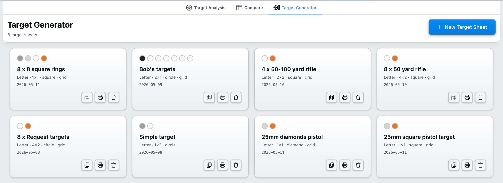

#### 7.3.1 Creating a Target Sheet

Click **New Target Sheet** in the page header to open the designer with a blank sheet.

| Field | Description |
|-------|-------------|
| **Name** | A label for the sheet, e.g., *100 yd Load Workup* or *50 yd Pistol*. Displayed on the sheet card. |
| **Page Size** | Letter, A4, or Legal. |
| **Orientation** | Portrait or Landscape. |
| **Columns × Rows** | Number of targets across and down the page (1–4 each). A 2 × 3 layout prints 6 targets per page. |
| **Shape** | Target shape: Circle, Square, or Diamond. |
| **Show Annotation** | Whether to print load/firearm annotation labels on each target slot. |
| **Annotation position** | Whether annotation text appears inside the rings or outside below the target. |

Click **Save Sheet** to save or **Cancel** to discard changes. The **Print** button in the designer header opens the print dialog directly from the editor.

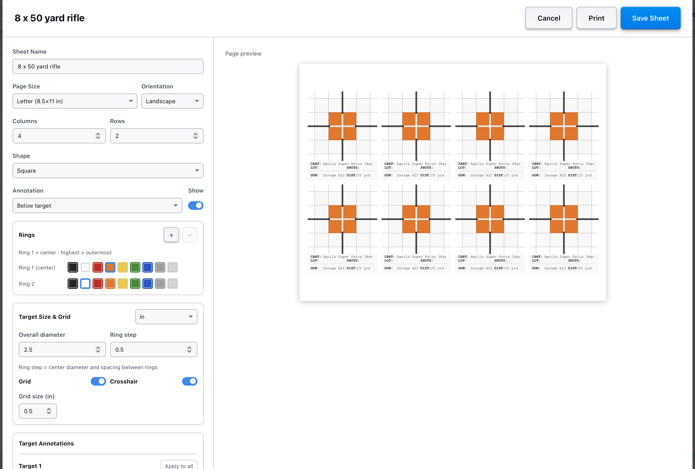

#### 7.3.2 Configuring Rings

Each target has concentric scoring rings. The innermost ring is Ring 1; higher numbers are progressively outer rings. You can add up to **10 rings** and remove down to a minimum of **2**.

For each ring, configure:

| Option | Description |
|--------|-------------|
| **Color** | Choose from: black, white, red, orange, yellow, green, blue, grey, or silver. Each ring can be a different colour to create high-contrast scoring zones. |
| **Overall diameter** | The outer diameter of the outermost ring (in inches or mm). |
| **Ring step** | The spacing between consecutive ring edges; controls how wide each scoring band is. |

Use the unit dropdown (in / mm) to switch between inches and millimetres; all diameter values convert automatically.

The real-time preview on the right updates immediately as you adjust ring counts, colours, and sizes.

#### 7.3.3 Layout, Page Size, and Grid

**Layout**

The columns and rows settings define how many targets are tiled on a single page. Use a high-density layout (e.g., 3 × 4 = 12 targets per sheet) for small pistol targets or load-development series where you need many aiming points, or a 1 × 1 layout for a single large precision rifle target.

**Grid overlay**

Enable **Show Grid** to print a background grid over each target; useful as a visual reference for estimating point of impact at a glance. Set the **grid cell size** in the same unit as the ring diameters. The **crosshair** (centre lines) can be shown or hidden independently of the grid.

#### 7.3.4 Annotations

When **Show Annotation** is enabled, each target slot on the sheet has an independent annotation block. For a 2 × 3 sheet, six annotation sections appear in the designer, one per slot, labelled *Target 1*, *Target 2*, and so on. Fill these in before printing so the load and firearm information is already on the sheet when you pull it off the printer.

Each annotation has a **mode toggle**:

| Mode | Fields |
|------|--------|
| **Handload** | **Journal Lot** (searchable dropdown from your journal entries), Firearm, Distance, Group size, Avg velocity, SD, Notes |
| **Factory** | Cartridge name, Lot #, Firearm, Distance, Group size, Avg velocity, SD, Notes |

**Filling multiple targets quickly**

- **Apply to all**: appears on the first target slot. Copies all annotation values from Target 1 to every other slot on the sheet. Use this when all targets on the sheet are for the same load and firearm.
- **Copy prev**: appears on each subsequent slot. Copies annotation values from the immediately preceding slot, useful for sequential load development targets that share most fields but differ in one entry.

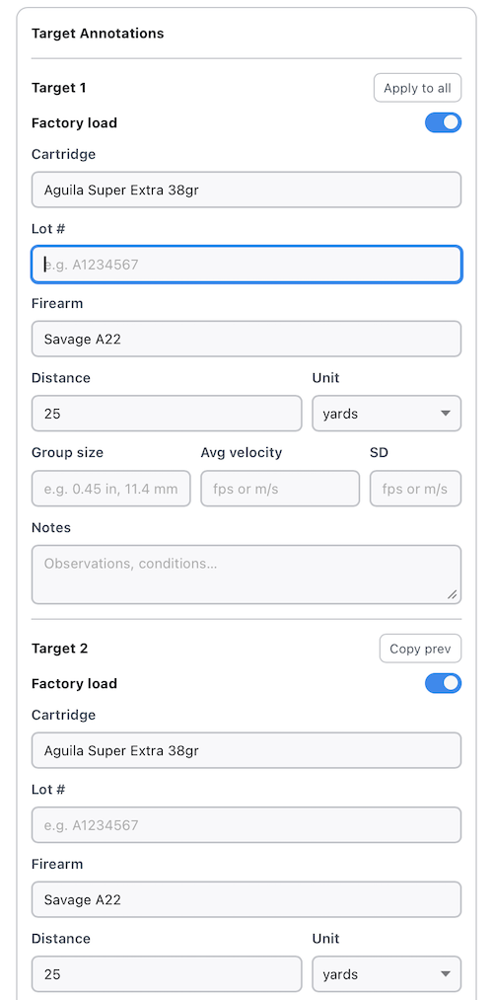

#### 7.3.5 Managing Target Sheets

Saved sheets are displayed as cards in the Target Generator sub-tab. Each card shows:
- A row of **ring colour swatches** showing the colour scheme at a glance
- Sheet name, page size, columns × rows layout, and shape
- Last updated date

Each card has three action buttons:

| Button | Action |
|--------|--------|
| ⧉ Duplicate | Creates a copy of the sheet with all ring settings, layout, and configuration. Useful for creating variants of the same target with different ring sizes or colours. |
| 🖨 Print | Opens the print dialog for this sheet without opening the full designer. |
| 🗑 Delete | Permanently removes the sheet (a confirmation dialog appears first). |

Click the card itself to reopen the designer and edit the sheet.

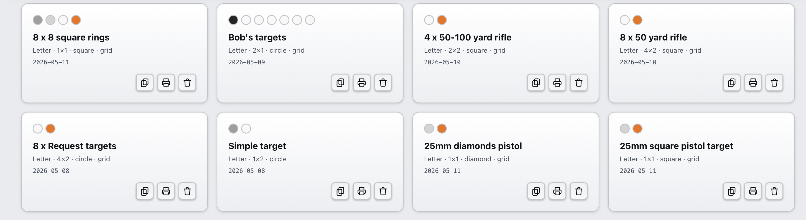

#### 7.3.6 Printing a Target Sheet

Click **Print** on any sheet card, or click the **Print** button inside the designer, to open the print dialog.

The dialog shows:
- Sheet name, page size, layout (columns × rows), and shape
- A preview of the first target as it will appear on the printed page

Click **Print** to send the sheet to your printer. The printed output matches the designer preview: all configured rings, colours, grid lines, and annotation fields are included exactly as shown.

---

## 8. Cost Analysis (Break-Even)

The **Cost Analysis** tab shows how the cumulative cost of reloading (including your one-time equipment investment) compares to buying factory ammo over time, and at what point reloading becomes cheaper overall.

### 8.1 Load Selection

The left column lists all your reload and factory entries.

By default, both reloads and factory ammo use **checkbox selection**. Check the entries you want to include in the averages. If nothing is checked, **all entries of that type are included automatically**.

For reloads only, you can also switch to **Rounds** mode using the flip switch at the top of the panel. In this mode:

- Reload entries accept a round count instead of a checkbox.
- The app calculates a **weighted average reload cost** based on the number of rounds entered for each reload.
- Factory ammo remains checkbox-based even in this mode.

**Journal integration in Rounds mode**

The round counts you log in the **Journal** tab are automatically reflected here. The number shown next to each reload's input is its *effective total*: the value you manually entered (your pre-journal baseline) plus the rounds logged in the journal.

This is designed for reloaders who were already pressing ammo before starting the journal. Enter your historical round count in the input as a baseline; the journal adds to it going forward. If you start fresh, leave the input at zero and the journal fills it in automatically.

### 8.2 Equipment Costs

The right column is where you enter your one-time reloading equipment costs (press, dies, tumbler, scale, etc.)

- Type a name and price in the **New item** row and press **Enter** or click **+** to add it.
- Click **✕** to remove an item.
- The running **Total Equipment Cost** is shown at the bottom.

This total is treated as an upfront investment that your per-round savings must recover before reloading becomes net-positive.

This cost can be ignored by switching off the **Include** switch.

### 8.3 Reading the Chart & Stats

The **stats bar** across the middle column shows the main values used in the break-even calculation:

| Stat | Meaning |
|------|---------|
| **Avg Reload Cost** | Average cost per round across selected reload entries |
| **Avg Factory Cost** | Average cost per round across selected factory entries |
| **Savings per Round** | Factory average minus reload average |
| **Break-Even Point** | Number of rounds until cumulative savings cover total equipment cost |

When **Rounds** mode is enabled for reloads, additional progress values appear:

| Stat | Meaning |
|------|---------|
| **Reload Rounds Logged** | Total effective rounds (manual baseline + journal) across all reload recipes |
| **Rounds Remaining** | How many more reload rounds are needed to reach break-even |
| **Total Savings So Far** | Current savings based on the effective reload rounds, optionally net of equipment when **Include** is enabled |

The **chart** below plots two lines:
- **Reload line**: cumulative spend including the equipment investment upfront, declining in slope as per-round costs are cheaper than factory.
- **Factory line**: cumulative spend at factory prices with no upfront cost.

The point where the lines cross is the **break-even point**, marked on the chart. After that point, every round you reload puts money back in your pocket.

In reload **Rounds** mode, the chart also shows your **current position** on the timeline based on the total effective reload rounds, making it easier to see how far along you are toward break-even.

If the reload average is higher than the factory average (reloading is more expensive per round), the lines never cross and a warning is shown.

---

## 9. Cost Comparison

The **Cost Comparison** tab lets you select any combination of reload and factory entries and compare their costs side by side.

**Selecting entries**  
Click any entry in the selection list to toggle it on or off. Selected entries are highlighted: green for reloads, amber for factory ammo. You can select multiple reloads and multiple factory entries simultaneously.

**Reading the comparison**  
Once entries are selected, the view shows:

- A **bar chart** of cost per round for every selected entry.
- A **cost table** with totals for 50, 100, and 1,000 rounds for each entry.
- A **Difference** section (visible when at least one reload and one factory entry are selected) showing how much cheaper your reload is per round, per 50, per 100, and per 1,000 rounds.

Use the **Search** box above the selection list to filter by name, caliber, type, or component.

---

## 10. Guided Tour

Click **Tour** in the top navigation bar to start the built-in walkthrough at any time.

The guided tour highlights the major parts of the application and explains:

- how to add and manage ammo entries
- how to use the inventory and linked components
- how to build and manage firearm profiles in the Firearms Registry
- how to log pressing sessions in the Journal and assign lot numbers
- how to record range sessions in the Range Log and track lot performance in the field
- how to compare reloads and factory ammo
- how to use the break-even analysis
- how to switch between simple selection and reload round-count analysis
- which values to check in the analysis stats cards

The tour can be dismissed at any time and is designed to help first-time users get oriented quickly.

---

## 11. Settings & About

The top-right area of the header includes both an **About** button and a **Settings** button.

**Settings**
- **Follow Time Of Day**: automatically uses the light theme during the day and dark theme in the evening
- **Currency Symbol**: changes the currency shown across cards, tables, and analysis views
- **Cost Per Round Decimals**: controls how many decimal places are shown for per-round costs

The application still defaults to the **dark theme** on first launch. If you enable **Follow Time Of Day**, the app will switch themes automatically based on the time of day. You can still use the theme toggle in the header to return immediately to manual light/dark mode.

---

## 12. Import & Export

Your entire library (ammo entries, tax defaults, equipment costs, load selections, component inventory, reloading journal, range log, firearm profiles, and target analysis records including photos) can be saved to a file and restored later or transferred to another computer.

**Exporting**
Click **Export** in the top navigation bar. A `.zip` file is downloaded to your machine. The archive contains all your data and any target photos you have uploaded, compressed into a single portable file.

**Importing**
Click **Import** and select a previously exported `.zip` file (or a `.json` file from an older export). A confirmation dialog shows whether a backup will be made before overwriting your current data (see Auto-backup below). Confirm to proceed. All data in the file replaces the current library.

> **WARNING: Import overwrites your current data.** Export first if you want to keep your existing entries, or enable Auto-backup in Settings so a backup is downloaded automatically before every import.

**Auto-backup**
In **Settings**, the **Auto-backup on import** toggle controls whether the application automatically downloads a backup `.zip` of your current data before replacing it with the imported file. Enabled by default. If you disable it, no backup is saved and the import is immediate and irreversible.

**Backward compatibility**
`.json` files exported by earlier versions of the application can still be imported. Target photos are not included in `.json` exports (they were not supported in that format); all other data is restored in full.

<!-- IMAGE MAY NEED UPDATING: navigation bar now includes the Firearms tab between My Components and Journal -->

---

## 13. Tips & Notes

- **All data is stored locally.** No account or internet connection is required. Data is saved automatically in the browser/app storage every time you make a change.
- **Brass reuse count matters.** Setting a realistic reuse count (commonly 5–10 reloads per case) significantly lowers your per-round brass cost. A count of 1 treats every case as single-use.
- **State Excise Tax (SET).** Factory ammunition in some US States is subject to a state excise tax in addition to state and local sales tax. The default value is pre-filled for you.
- **Fix Fee (FF).** Some US States have an additional fix fee (normally associated to a background check) on any ammunition purchases. This is a fixed fee applied to the entire purchase and its cost is diluted over all the rounds purchased.
- **Accuracy of results.** All costs are estimates based on the prices you enter. Check current component and ammo prices regularly, as they fluctuate.
- **Use load status to manage your library lifecycle.** Mark new recipes as **Draft** while you are costing them out, move them to **In Development** once you are working them up at the range, promote to **Active** when proven, and **Retire** recipes that have been superseded. Retired loads disappear from default views without losing any journal history.
- **Duplicating entries** is a quick way to model variants: duplicate a load, change the powder charge or bullet weight, and compare side by side in the Cost Comparison tab.
- **Equipment costs** only need to be entered once. They persist between sessions and are included in export files.
- **Use the inventory for shared components.** If you load multiple calibers with the same powder or primer, define it once in My Components and link it to all relevant loads. A single price update flows through everywhere.
- **Inventory lists are alphabetical.** Components inside each inventory group are ordered by name to make powders, primers, bullets, and brass easier to scan.
- **Stock tracking is opt-in per component.** Leave **Stock on hand** blank for any component you do not want to track. Only components with a stock quantity set appear in the journal deduction flow; untracked components are simply ignored by the deduction button.
- **Stock deduction follows charge overrides.** If a journal entry has a powder charge override, the deduction uses that override amount rather than the recipe's default charge. Always review overrides before deducting.
- **The Low badge is informational only.** A component showing a Low badge can still be used in new journal entries and deductions. The badge is just a visual reminder to restock; it does not block any workflow.
- **Returning stock undoes the deduction completely.** Clicking the ✓ Stock badge on a journal entry restores the full deducted amount for all linked components. If you need to correct a quantity, return the stock, edit the entry, then re-deduct.
- **Brass override deductions match by name.** If a journal entry specifies a brass override (free-text field), the deduction looks up the brass inventory item by that exact name. Make sure the override text matches the inventory item name exactly, or the brass deduction will be skipped for that entry.
- **Powder quantity field.** When entering a powder in the inventory, set the quantity to match how the powder is sold (1 lb, 4 lb, 8 lb, etc.). The app calculates the per-lb rate automatically and uses it when costing a load.
- **Unlinking a component.** Manually editing any field in a linked component section (name, price, quantity) automatically breaks the inventory link. The load keeps the values you typed but is no longer updated when the inventory item changes. Use the **×** on the badge to unlink without changing any values.
- **Deleting an inventory item** does not delete any loads that used it. Those loads retain the component values they had at the time the link was broken.
- **Journal lot numbers never repeat.** Deleting an entry does not reuse its lot number. The next new entry starts from the **Starting lot #** you configured in the Journal header, then increments past any already-used numbers until it finds the next free slot. This means you can lower the starting lot number to fill in historical batches without creating duplicates, and existing entries are never displaced.
- **Journal baseline for existing reloaders.** If you were reloading before you started using the journal, enter your historical round count as the manual baseline in Cost Analysis Rounds mode. The journal will add to it going forward, keeping your break-even progress accurate.
- **Label printing from the journal.** The quickest way to print a box label is directly from the Journal; the lot number and quantity are already filled in. You only need to confirm and print.
- **The bench-to-range loop.** Use the Journal to record what you pressed, then use the Range Log to record how each lot performed at the range. The two tabs together give you a complete picture: production history in the Journal, field performance in the Range Log.
- **Multiple lots in one range session.** A single range session can include several lots, for example if you ran three different powder charges side by side. Add one lot entry per charge weight so each gets its own round count and notes.
- **Range Log notes for load development.** Use the per-lot notes field in the Range Log to record group sizes, point of impact shifts, felt recoil, or function issues. Over time this builds a development log you can cross-reference when adjusting a recipe.
- **Star your reference loads.** Once you find a load that functions and groups well, star that range session. The starred filter gives you a quick shortlist when you are deciding what to press next. Starring a session also stars the linked journal lots automatically, so both records are flagged together.
- **Remaining Rounds keeps your shelf count accurate.** Log rounds against journal lots in the Range Log using **From Journal** mode and the Remaining column updates automatically. Lots that reach zero are marked Depleted and hidden from the From Journal dropdown so you cannot accidentally log against an empty lot.
- **Archive completed lots to keep the journal tidy.** Once a lot is fully fired and you no longer need it in the active list, archive it. The lot stays in your history and still contributes to statistics; it just does not appear in the main journal table. Restore it at any time if you need to reference or reprint the label.
- **Velocity unit preference is global.** The fps / m/s toggle in the Range Log header applies to every session in the list and carries over into the add and edit forms. Switch once; it stays set until you toggle it again.
- **Range Log data is included in export files.** When you export your library, your full range log history is included. Import it on another machine and your field records move with you.
- **Firearms Registry data is included in export files.** All firearm profiles are exported with your library and restored on import, so your full registry travels with your data.
- **Add firearm profiles before logging range sessions.** Populating the Firearms Registry before your first range session means the firearm selector in the Range Log form will already have your guns listed, saving you from typing them out each time.
- **Caliber on a firearm profile enables grouping and filtering.** Profiles without a caliber still appear in the registry and the Range Log dropdown, but they fall into an Uncategorized group and do not generate a caliber filter chip. Set the caliber if you want to use the chip filter to narrow down multi-gun sessions by cartridge family.
- **Deleting a firearm profile does not affect past sessions.** Range Log entries record the firearm name as a string at the time of logging. Removing a profile from the registry does not alter any historical session records; the name is preserved exactly as it was when you logged it.
- **Twist rate is useful during load development.** Enter the twist rate on your rifle profiles (e.g. *1:10*) so you have it on hand when selecting bullet weights during load development; heavier, longer bullets need faster twist rates to stabilise, and having the spec in the registry saves you from looking it up every time.
- **Charge workup and the journal are connected.** When you log entries from the Charge Workup panel, they appear in the Journal as normal lot entries. When you later log those lots in the Range Log (select them **From Journal**), the velocity and group data flows back into the workup chart automatically, no extra steps needed.
- **Link range sessions to workup lots using "From Journal" mode.** When adding a lot in the Range Log, select **From Journal** and pick the lot number that the Charge Workup panel created. This is what connects your range data to the workup chart; if you use the Reload or manual mode instead, the lot number may not match and the data will not appear on the chart.
- **The workup chart needs at least two data points.** The velocity and group chart only appears once two or more distinct charges have been fired and recorded in the Range Log. Until then, the table gives you the data in row form.
- **Multiple lots at the same charge show as separate diamonds.** If you pressed and fired two batches at the same charge weight (e.g. two lots of 20 rounds), the chart shows a diamond for each lot alongside the average line, so you can see how consistent your results are across batches.
- **Ad-hoc charges let you test outside the ladder.** Use the *Add charge* field in the workup panel to add a step that falls outside your configured min–max range, for example to test a charge that looks promising based on early data. The entry is held as a pending row in the table until you click Log Entries, so you can still choose to exclude it before logging.
- **Promote unstars the previous winning charge.** If you promote a charge, then later start a new development cycle and promote a different charge, the application automatically removes the star from journal entries for the old charge and stars the new one. Your starred filter in the Journal always reflects the current best load.
- **Workup history is preserved after promotion.** Promoting a charge does not delete the ladder or its data. The full development history remains visible in the workup panel (and on the printed data sheet) even after the load is Active.
- **Calibrate before placing shots.** Set both reference points and enter the known distance before marking any impacts. The calibration can be changed later, but the statistics update immediately so it is most efficient to calibrate first.
- **Use a known reference on the target.** A printed grid square, the bullseye ring diameter, or a target's stated scoring ring size all work as calibration references. Write the distance in millimetres or inches before the session so you have it ready when you upload the photo.
- **Bullet diameter refines your statistics.** Enter your bullet's diameter in the Configuration panel. The app uses it to measure Extreme Spread and the Smallest Enclosing Circle from the outer edges of the holes (as if the holes were touching), the same way groups are conventionally measured with a calliper. Without bullet diameter, all measurements are centre-to-centre.
- **Groups let you compare loads on the same target.** If you fired two charge weights or two different loads at the same aiming point, assign their impacts to separate groups. Each group gets its own colour, its own statistics, and contributes to the aggregate calculation.
- **The aggregate view removes POI differences between groups.** When you have two or more groups, the Aggregate view re-centres each group's shots onto the origin before computing statistics. This removes the point-of-impact offset between loads and gives you a pure measure of each load's internal dispersion; useful for comparing group size consistency independently of where each load prints on the target.
- **Link targets to sessions for bidirectional navigation.** In the target's Configuration panel, select the range session this target came from. A navigation button then appears in both the Targets tab (go to session) and in the Range Log session row (go to target), so you can jump between the two records with one click.
- **Printed session sheets include the target.** When you print a range session that has a linked target, the target image with annotated shots, ES line, mean-radius circle, and CEP50 circle is automatically included at the bottom of the printed sheet along with key statistics, no separate step needed.
- **Target records are included in export files.** All target photos, calibration data, impact coordinates, groups, and session links are exported with your library and restored on import.
- **Target Generator sheets are also included in export files.** All designed target sheets (including ring settings, layout, and annotations) travel with your export and are restored on import.
- **Design once, reprint any time.** Saved target sheets stay in the Target Generator sub-tab permanently. Come back weeks later and reprint the same sheet without reconfiguring it.
- **Use Duplicate to create variants.** If you want the same sheet in a different ring size or with a different colour scheme, duplicate the sheet and adjust the copy. Both versions are preserved independently.
- **Apply to all for fast annotation.** Fill in Target 1's annotation fields completely, then click **Apply to all** to copy them to every slot in one click. Only use Copy prev when adjacent targets differ by a single field (e.g. different lot numbers or charges).
- **Landscape orientation fits more targets per sheet.** For small pistol targets or load workup grids, switching to landscape and increasing the columns count can fit significantly more aiming points on a single page.
- **Match ring colours to your shooting conditions.** Use high-contrast colour schemes (e.g., black rings on a white target) for bright outdoor conditions and lighter rings with a black background for lower-light indoor ranges.
- **Best group badge marks the top performer.** In the Target Analysis sub-tab, when two or more groups are present, the group with the smallest Extreme Spread is marked with a ★ badge in the groups list. This gives you an instant visual indicator of which load performed best without reading through each group's statistics individually.
- **The target list shows aggregated group size for multi-group targets.** When a target has two or more groups, the shot count and group size shown in the target list uses the aggregate calculation (centering each group on the origin and computing ES across all re-centred shots) rather than treating all impacts as one group. This gives you a meaningful group-size summary for load-comparison targets at a glance.
